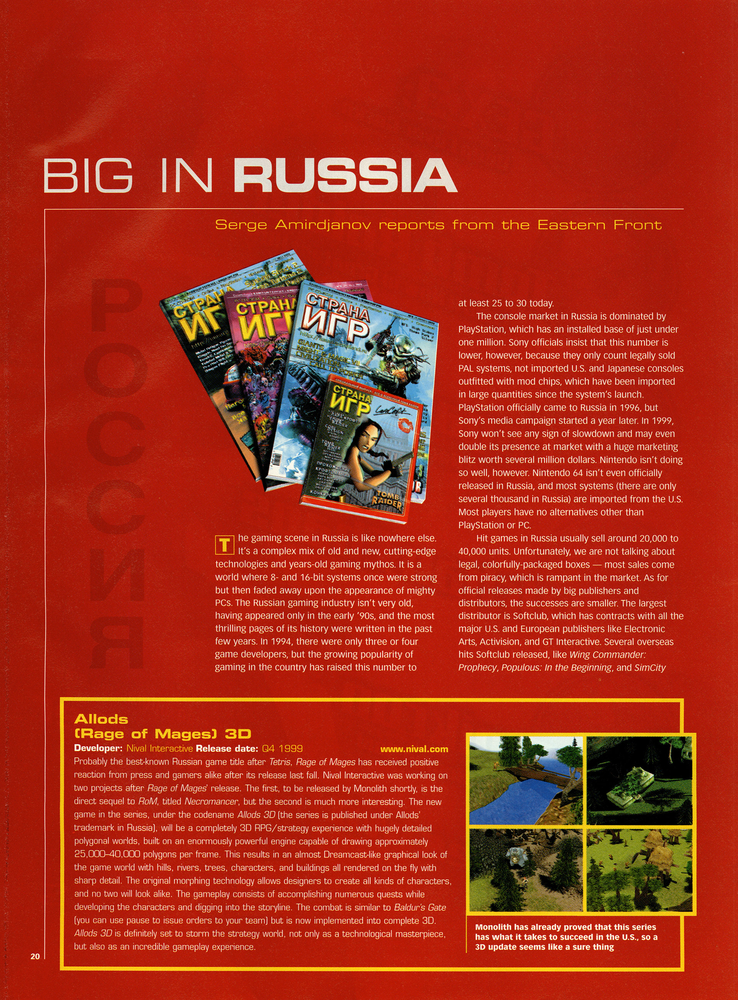
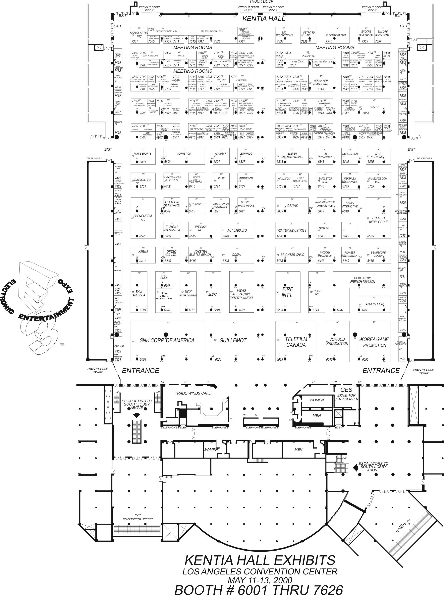
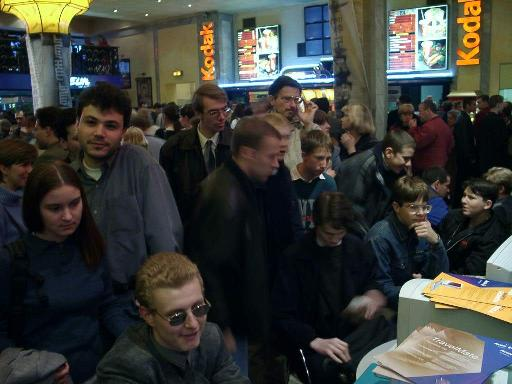
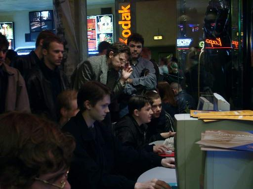

## ECTS
(источник: https://allods.gipat.ru/sites/nival_.com_.ru_RU_EN_2000/rus/oldnews_r.html)

## E3
1999

2000 (11-13 мая 2000)
(источник: https://allods.gipat.ru/sites/nival_.com_.ru_RU_EN_2000/rus/pr050500_r.html)

(источник: http://www.seanbaby.com/e3/erik/erik_kentia_01.htm)

 

(стенд 6643 - Ravensburger interactive)

# Comtek 2000 (май 2000)

(источник: https://allods.gipat.ru/sites/nival_.com_.ru_RU_EN_2000/rus/oldnews_r.html)
(источник: https://allods.gipat.ru/sites/nival_.com_.ru_RU_EN_2000/rus/pr050500_r.html)

# Кодак-Киномир (14 сентября 2000)
(фото с: https://evilislands.narod.ru/archive_sept.htm)

# чё то в Корее

> **: 이벤트 소식**  
> 5월 5일, 6일 양일간 이블아일랜드 어린이날 이벤트 개최 
> 
> 용산 나진상가 건너편에 위치한 소프트웨어 전문 판매점인 라이징의 2층 매장에서 국내에서 유통을 전문으로 하는 이원코리아가 최근에 출시한 풀3D 판타지 롤플레잉 이블 아일랜드의 시연회가 5월 5일과 6일 양일간 개최되었다.\[05/07] 

 

> 5월 5일 어린이 날(토요일)과 6일인 일요일에 전자상가를 찾은 사람들에게 이블 아일랜드를 상징하는 신비스러운 각인 마크가 새겨진 마우스 패드와 포스터를 증정했으며 2층에 마련된 장소에서는 이블 아일랜드를 즉석에서 시연할 수 있는 장소가 마련되었다.  
> 
> 또, 도우미들의 현란한 춤과 적극적인 홍보로 인해 많은 게이머들이 관심을 가졌다. 특히, 5월 5일 어린이날을 맞이해 선물 구입을 하려는 많은 사람들로 인산인해를 이루었다.  
> 
> 기사 : 게임터보 \[05/06]

> 이블 아일랜드 4월 27일 발매 카운트 다운 전 용산 전자상가에서 대대적인 홍보  
> 
> 금일 용산 전자상가를 방문한 수많은 사람들은 4명으로 구성된 여성 도우미들이 피켓을 들고 무엇인가를 홍보하는 모습을 보았을 것이다.  
>   
> 바로 4월 27일 국내 출시를 앞두고 있는 판타지 롤플레잉 이블 아일랜드의 홍보를 위한 용산 전자상가 가두 행진으로 선인상가를 시작으로 ,고속버스 터미널, 전자상가등의 코스를 순회해 많은 사람들의 주목을 받았다.  
>   
> 이블 아일랜드는 현재 해외에서 출시 후 올 상반기에 주목을 받고 있는 게임 가운데 하나. 이번 도우미들의 가두행진 이벤트는 당분간 계속될 예정으로 평일과 매주 토요일 용산 전자상가를 찾는 게이머들은 이블 아일랜드를 홍보하는 도우미들을 볼 수 있을 것이다. 기사 : 게임터보 \[04/21]

