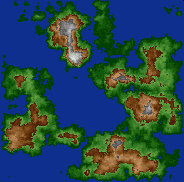
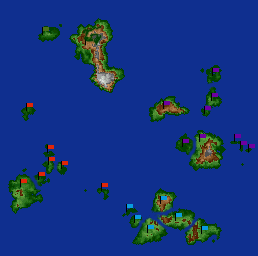

> [!NOTE] Извлечённые метаданные
> Программа: Microsoft Word 8.0
> Автор: Dmitry M. Devishev
> Отредактирован: Andrey Makhovikov
> Дата создания документа: 28 апреля 1998
> Последнее редактирование: 5 марта 1999
> Расположение(я):
> Dmitry M. Devishev C:\TEMP\Автокопия World Setting 1.7
> Dmitry M. Devishev D:\Docs\Allods3d\Scenario\World Setting 1.8.doc
> Dmitry M. Devishev D:\Docs\Allods3d\Scenario\World Setting 1.9.doc
> Dmitry M. Devishev D:\Docs\Allods3d\Scenario\World Setting 1.10.doc
> Dmitry M. Devishev \\FILESERVER\WRITEWORKS\Allods3D\World Setting\World Setting 1.10.doc
> Andrey Makhovikov F:\\\[A]Korvin\quests\World Setting 1.10.doc
> Andrey Makhovikov D:\\-WIN98-\TEMP\Автокопия World Setting 1.asd

**Устройство Мира Аллодов**

#### Содержание

**1.**      **Космос**

1.1.    Эфир

1.2.    Астрал

1.3.    Внутренние миры

1.4.    Внешние миры

**2.**      **Мир Аллодов**

2.1.    Боги

2.2.    Основные расы

2.3.    Великие Маги

2.4.    Континенты

2.5.    Государства

**3.**      **Континент Йул**

**4.**      **История**

4.1.    Приход рас

4.2.    Появление государств

4.3.    После Катаклизма

**5.**      **Расы**

5.1.    Люди

5.2.    Эльфы

5.3.    Гномы

5.4.    Орки

5.5.    Гоблины

5.6.    Минотавры

5.7.    Огры

5.8.    Драконы

5.9.    Тролли

**6.**      **Аллоды**

6.1.    Аллоды Кании

6.2.    Аллоды Кадагана

6.3.    Аллоды Эльфов

6.4.    Аллоды Орков

**7.**      **Великие Маги**

7.1.    Конклав

7.2.    Заклинатель Леса

7.3.    Незеб

7.4.    Скракан

7.5.    Тенсис

7.6.    Гурлухсор

7.7.    Верховный Шаман

**8.**      **Легенды Аллодов**

8.1.    Битва Эльфов с Минотаврами

8.2.    Битва Кании с орочьим Роем

8.3.    Восстание Культа Незеба

# **Космос**

Мир аллодов, и миры параллельные ему, окружены астралом и эфиром. Астрал и эфир можно воспринимать как пограничные миры, а можно – как состояние (психологическое или физическое). Через эфир «материальные» миры способны связываться со своими энергетическими основами, прототипами – такими, как огонь, вода, воздух, земля, возможно еще некоторые менее важные составляющие. Через астрал же может быть осуществлен контакт с другими мирами – не просто стихиями, а мирами типа Ада, Рая, Хаоса, проч. На которых может существовать и разумная жизнь (демоны, ангелы).

Предлагаются термины: миры типа Аллодов – материальные миры, их энергетические прототипы (огонь/вода) – внутренние миры, миры типа Ада – внешние миры. Вариант: внешние миры суть то же, что и материальные. Вариант: внутренние миры по пачке на каждый материальный, или одни на всех. Подразумевается также, что внешние миры – божественные, внутренние – магические. Предложение: ввести также (как опцию) негативный, позитивный, и теневой внутренние миры. Видимые горбухи: телепортация внутри одного аллода логичнее через эфир, между аллодами – через астрал, вообще слабые маги должны работать с эфиром, а не астралом. Но в принципе для можно просто объединить эфир и астрал в «астрал».

**Эфир(ethereal plane)** – как бы еще одно измерение материального мира, благодаря которому возможен контакт с внутренними мирами. Маги черпают свои силы либо из эфира, либо через эфир. Возможно находится «в эфире», не находясь при этом ни на материальном, ни на одном из внутренних миров. Например, маг может, войдя в эфир и находясь в ethereal state, проходить сквозь стены, etc. Это также может использоваться для телепортации, предсказаний/дальновидении, невидимости, etc.

**Астрал(astral plane)** – аналогично эфиру, но не является оболочкой данного материального мира, а оболочкой всех их. Условно говоря, это океан, где каждый остров – это мир со своей эфирной оболочкой. Любые контакты с другими мирами – через астрал. Контакты с богами, демонами, проч., предсказания требующие сверхчеловеческих знаний/прогнозирования, призывание существ несуществующих в данном мире, проч. – это все магия, использующая астрал.

**Внутренние миры(inner planes)** – не материальные миры, а скорее составляющие их. Не обязательно представлять их как 3д пространство. Основные внутренние миры – это миры Огня, Воды, Земли и Воздуха. Также есть другие – Негативный, Позитивный, мир Теней, и другие..

**Внешние миры(outer planes)** – достаточно «нормальные» миры. Суть их не в энергетической/материальной основе, а в интеллектуальной/философской. Вырожденные случаи внешних миров – это Рай или Хаос.

(здесь должно быть описание миров и богов, а также история создания мира)

# Мир Аллодов

**Боги** – этот мир мало затронут богами. Великие Боги давно не проявляют себя. Меньшие Боги действуют либо через религиозные объединения, либо (редко) – через аватаров (в основном в виде артефактов). В любом случае их влияние достаточно локально. Основные проявления богов – хаос/порядок, поддержка рас. Практически никак не проявляют себя боги ремесел, природы, добра/зла.

(описания богов и пантеонов)

**Основные расы** – это люди, эльфы, орки, гномы, гоблины и минотавры (среди гуманоидов). Также важны драконы и огры. Люди и эльфы в основной массе не агрессивны друг к другу. Орки как правило властвуют над гоблинами. Гномы и минотавры – сами по себе, хотя гномы могут устанавливать отношения с хуманами и эльфами, а минотавры – создавать союзы с орками. Но всегда могут быть исключения. Огры и драконы – по сути одиночки, которые редко создают крупные поселения, и не имеют государственной структуры. Их альянсы зависят от конкретного индивидуума. Также имеется множество полу разумных сказочных рас, встречающихся повсеместно в небольших количествах.

Вот список разумных и полу разумных рас, которые не являются большой политической силой, но встречаются в мире Аллодов (названия сугубо условные, для понятности некоторых взяты аналоги из ad&d):

sylvan:                 dryad/nymph, centaur, pixie/nixie, sprite, pegasus, satyr, unicorn, brownie.

evil humanoids: mind flayer, doppelganger, gremlin/imp, harpy/siren, lizardman, rakshasa, sahuagin.

evil monsters:      genie, giants/cyclopes/titans, naga, sphinx.

other:                   beholder/IQ devourer, dinosaurs, elemental kin, phoenix, merman, lycanthrope.

**Великие Маги** – основная сила в Аллодах – это Великие Маги. Особенно после Катаклизма. Великих Магов – несколько десятков, приблизительно каждое поколение появляется новый Великий Маг и исчезает один их старых. Поэтому их количество приблизительно постоянно. Большинство Великих Магов – эльфы и люди, но многие люди разделены на кланы и действуют сообща, а эльфы в основном – одиночки. Нет как таковой системы (социума, совета, объединения) Великих Магов. Практически все задачи решаются в одиночку или кланами, хотя если несколько кланов объединятся для выполнения какой-либо задачи, то над ней может работать более половины всех имеющихся Великих Магов.

По определению, Великий Маг – это чародей, способный серьезно оперировать астральной магией. Что приводит к таким возможностям, как бессмертие, предсказание будущего, контакт с богами и другими мирами, и много чего еще, недоступного «эфирным» чародеям. После Катаклизма Великий Маг стал еще и подразумевать наличие аллода – т.е. маг, который может «удерживать» аллод в астрале, и есть Великий. Итого, количество Великих Магов может уменьшатся, но не расти. Если уходит один из старых магов, то можно поспешить и заменить его на одного из наиболее сильных «свободных» (без аллода) магов – и если ему удастся «удержать» этот аллод – он становится Великим Магом. Вполне возможно наличие «свободных» магов, которые сильнее, чем какой-нибудь Великий Маг, но признан Великим он будет только когда обзаведется своим аллодом. Тут возможно много заморочек в смысле клановых войн, попыток вытеснения старых магов новыми (с возможной пропажей аллодов), прочее..

После обсуждения: термин «Великий Маг» относится в первою очередь к Конклаву могущественных магов, который занимается сертификацией, улаживанием конфликтов, обменом информацией и проч. – между своими членами. Т.е. держателем аллода может быть сильный «астральный» маг, но он может и не быть официально признан «Великим».

(описание лун, систем магии)

**Континенты** – до Катаклизма было несколько континентов, отличающихся друг от друга как климатом, так и представленными на них расами и государствами. После Катаклизма континенты распались на множество островов. Далее описание будет относится только к континенту Йул, распавшемуся на порядка 30 аллодов.

(общее описание других континентов)

**Государства** – после Катаклизма прежние государства потеряли смысл. Прежде, имелось несколько крупных государств, разделявших между собой территорию континента (Йул). Прежде всего это людские империи Кания и Кадаган, далее – это оркская территория и эльфийское царство. Так как аллоды образовались вокруг удерживающих их магов, то города крупнейших государств не были потеряны. Некоторые аллоды, которые входили в прошлом в одно государство, объединялись, и таким образом возникало что-то типа союза аллодов. Таким образом пошли империи Кании и Кадагана, хотя они потеряли части территорий, где не было магов. Эльфы сохранили практически полностью свое царство, у орков же осталась небольшая часть былых владений, практически никак не связанных друг с другом – поскольку сами орки слабы в работе с астралом.

# **Континент Йул**

Континент Йул – один из крупнейших континентов мира Аллодов. Этот континент включает в себя три крупных острова и много мелких. После катаклизма он остался в виде около 30 аллодов. Континент делится на три региона – восточный, населенный в основном людьми, западный – населенный орками, и северный, на котором живут эльфы. Контитент находится в южном полушарии. Его климат варьируется от климата средней полосы, где зимой выпадает снег (крайний юг восточного региона), до экваториального (северный регион). Восточный регион характерен густыми лесами, обилием рек, наличием горных полос. Западный регион является в основном степным плоскогорьем, но содержит и пустыни, и холмистые местности. Северный регион выделяется обилием джунглей и озерных/болотистых местностей.

После Катаклизма континент принято разделять на регионы Кадагана, Кании, Эльфов и Орков. Основные изменения континета – это поглощение северной части восточного региона, где в экваториальных лесах жили племена людей-варваров, и исчезновение большей части территории орков. Надо также заметить, что эльфы сохранили большую часть своих владений – видимо, это обьясняется распространенностью среди них магии. На картах соответствующие регионы обозначены флажками: фиолетовый – Кадаган, голубой – Кания, зеленый – эльфы, красный – орки.

(описать силовые линии, нарисовать подробно климатические условия)

> [!NOTE] Примечание
> Файл с миром до катаклизма:
> D:\\\\Docs\Allods3d\maps\allods0.tif
> и после:
> D:\\\\Docs\Allods3d\maps\allods11.tif

| До Катаклизма    | После Катаклизма  |
| ---------------- | ----------------- |
|  |  |

# История

## Приход рас

WARNING - under construction.

## Появление государств

WARNING - under construction.

Минотавры устраивают набеги на орков, заставляя из двигаться на юго-восток.

Орда орков проходит сквозь восточные города людей с юга на север, но останавливаются варварами севера.

Орки оседают на западе Йул.

Создание Конклава Великих Магов.

Несколько людских городов объединяются против орды.

**Обьединеные города создают империю Кания.**

Орда орков уничтожена силами Кании.

Варвары севера входят в Канию.

Появление Незеба.

Сторонники культа Незеба объявляют выделение Кадагана из Кании.

**Война за независимость Кадагана.**

Тенсис приходит в Канию, и становится Советником Императора.

Кадаган совершает неудачную попытку захвата эльфов.

Скракан объявляет о выделении Умойра из Кадагана, и альянсе с Канией.

Война за Умойр.

Эльфы заключают мир с минотаврами.

## После Катаклизма

**0**                  **- Катаклизм.**

118        - Незеб устанавливает связь с аллодами Кадагана.

123        - Силы Незеба берут под контроль четыре аллода.

156        - Незеб пытается захватить Умойр.

158        - Тенсис и Скракан устанавливают связь с бывшими аллодами Кании.

162            - Шесть аллодов объявляют о восстановлении империи Кании.

189            - Конфликт на Умойре между Канией и Кадаганом.

312        - Скракан объявляет о независимости Умойра.

**576**            **- Скракан накрывает Умойр куполом.**

626        - Очередное обострение отношений между Канией и Кадаганом.

646        - Освобождение Скракана.

**653        - Конец войны между Канией и Кадаганом.**

672        - Смерть Великого Мага Суслангера.

# Расы

(дерево рас по наследованию и времени появления. увязать с созданием мира и богами)

(для всех рас – пантеон богов, культурные особенности, субъективная история, мифы/легенды, эскизы)

#### Люди(humans)

Наиболее интеллектуальная раса. Неплохо развиты ремесла и магия. Живут около 70 лет. Одна из «новых» рас. Будучи почти также многочисленны как орки, расселились по всему миру. Живут в основном в полях около воды. Среди людей имеется несколько видов – aro, ugra, zem и jun.

**Aro(белые)** – живут в средней полосе, преимущественно в полях и лесах. Государства типа феодальных, активно строят города. Производят много продовольствия. Среди них много магов, в том числе несколько Великих. На Йул их  живет около 200000, в основном – в Кании и Кадагане.

**Ugra(варвары,черные)** – встречаются в основном в тропическом/экваториальном климате. Городов не строят, имеют строй близкий к первобытнообщинному. Почти не владеют магией. Отличаются темной кожей. На Йул их жило около 50000, но практически все их земли потеряны, и сейчас и можно встретить только небольшими группами на аллодах, близких к Кадаганским.

**Zem(желтые)** – живут в средней полосе и тропиках. Селятся в большие метрополисы, очень хорошо владеют магией. Среди них есть Великие Маги. Желтая кожа. На Йул крупных поселений zem нет.

**Jun(древние,красные)** – предположительно, самый старый вид людей. Ранее жили в песках, в жарком климате. Селились зачастую в туннелях, проделываемых в горах. Этот вид почти полностью исчез много веков назад, но и сейчас встречаются его одичавшие представители. Первые люди - Великие Маги были из числа «древних», что можно заметить по коже с красноватым оттенком.

#### Эльфы(elves)

Наиболее магически одаренная раса. Владеют навыками обработки редких металлов, особенно сильны в создании магических вещей. Имеют способности к тонким ремеслам. Время жизни – около 300 лет. Будучи одной из наиболее древних рас, распространенны почти по всему миру. Имеют несколько крупных государств. Эльфы делятся на несколько видов – солнечные эльфы (наиболее многочисленны), лунные эльфы (озерные), звездные эльфы, и темные эльфы.

**Лесные (дикие, forest, wild elves)** – живут в основном в лесах, хорошо владеют магией воды и воздуха, много талантливых лучников. Зеленая кожа, темные волосы. Государство – феодальное. Живут на природе, не строят городов. С точки зрения людей, они достаточно дикие (нецивилизованные). Наиболее распространенный вид эльфов, на континенте Йул их живет более 70000. Устойчивая неприязнь к оркам и гоблинам. Характеристики - +10 дух, +20 ловкость, -20 разум, -10 сила.

Лесные эльфы намного тоньше и стройнее людей. Будучи чуть ниже ростом, они обладают узким тазом, и более блинными пропорциями рук и ног. Более худые и острые плечи, и также более тонкая и высокая шея являются их характерными признаками. Череп у эльфов уже, чем у людей. Лоб – высокий, скулы – узкие, подбородок острый. Также характерны уши с удлиненными мочками. Волосы у эльфов всегда прямые, в основном темных цветов. Кожа имеет зеленоватый цвет, но при загаре может приобретать буро-коричневый оттенок. Лесные эльфы – самая гибкая и грациозная из разумных рас.

**Лунные (озерные, moon, lake elves)** – живут в озерах. Владеют некоторой специфической магией (предсказания, дыхание под водой). Темная кожа, светлые волосы. Хорошо плавают, могут подолгу обходится без воздуха. Организованны как союз племен, хотя иногда объединяются вокруг оракулов/религии. Поселения – преимущественно «города на сваях», расположенные и над, и под водой. На Йул их около 5000.Характеристики - +20 дух, +10 ловкость, -10 разум, -20 сила.

**Звездные (чудные, star, faerie elves)** – преимущественно одиночки. Живут семьями, как правило в заколдованных семейных замках, далеко от других существ. Зачастую заколдовывают гору, или остров, и веками находятся там в уединении. Предположительно, являются первый видом эльфов. Живут очень долго, и неизвестно, могут ли они размножатся. Среди них немало Великих Магов. На Йул их – несколько семей, несколько эльфов в каждой. С окружающим миром практически не контактируют. Характеристики - +45 дух, -5 разум, -30 сила.

**Темные (подземные, dark, deep elves)**– предположительно, мутировавшие звездные эльфы. Отличаются от последних тем, что предпочитают селится под землей, иногда проявляют себя в политической жизни. На Йул они не замечены. Характеристики - +35 дух, -15 разум, - 15 сила.

#### Гномы(dwarves)

Наилучшие ремесленники. Контролируют добычу редких металлов. Хорошо обрабатывают камень, сильны в строительстве. Время жизни – около 100 лет. Практически самая древняя раса. Государства – кастовые, как правило объединяющие множество кланов. Живут в основном глубоко под землей, поэтому редко контактируют с другими расами. Делятся на горных гномов, и глубинных. Хотя могут быть очень большие отличия в зависимости от касты и клана. Наличие гномов на Йул неизвестно.

**Горные(mountain dwarves)** – живут в горах, преимущественно внутри их. Большое влияние имеет каста жрецов земли, владеющая соответствующей магией. Другие важные касты – воины, кузнецы, строители. Как правило живут в больших пещерах одним кланом. Характеристики - +20 сила, - 20 ловкость.

**Глубинные (темные, deep/dark dwarves)** – живут глубоко в недрах земли, никогда не выходя на поверхность. Имеют специфические зрительные и дыхательные органы. Организованны в государства с абсолютной властью жрецов. Вообще, у них магия более развита, чем ремесла. Среди них многие владеют стихиями огня и земли. Характеристики - +10 сила, -25 ловкость, -10 разум, +20 дух.

#### Орки(orcs)

По бойцовым качествам уступают лишь минотаврам. Очень сильны и выносливы, но слабо владеют ремеслами или магией. Живут около 30 лет. Одна из «новых» рас. Объединяются в орды для набегов, ведут преимущественно кочевую жизнь, хотя иногда и оседают. Оседать предпочитают в степях. Управляют гоблинами как низшей кастой. Среди орков встречаются шаманы, которые имеют большой авторитет в ордах – иногда даже верховодят ими. В степях на западе Йул обширные территории населены ими и гоблинами.  Характеристики: +10 сила, +10 ловкость, -10 разум, -10 дух.

#### Гоблины

Слабая раса, существующая в основном благодаря альянсу с орками и невероятной способностью размножаться при выгодных условиях. Влачат практически животное существование, живут около 20 лет. Жить предпочитают в лесостепях. Боготворят орков. Характеристики: -10 сила, +20 ловкость, -30 разум, -20 дух.

#### Минотавры

Самая сильная раса. Слабы в магии и ремеслах, но очень хороши в военном деле. Живут около 50 лет, немногочисленны. Организованы в племенные или феодальные сообщества. Живут в основном животноводством, периодически ведут войны. На Йул представлены небольшим пиратским государством на севере территорий орков. Характеристики: +25 сила, -15 разум, -10 дух.

#### Огры(ogres)

Раса гигантских гуманоидов, невероятной силы и непомерной тупости. Живут как правило поодиночке, иногда – семьями, если есть чем прокормиться. Зачатков государств, или хотя бы племен, не замечено. Характеристики: +50 сила, -20 ловкость, -30 разум, -30 дух.

#### Драконы

Драконы – преимущественно живут как одиночки или семьями. Обладают очень хорошими способностями к магии, но невысокий интеллект фактически не позволяет им изучать сложные заклинания. Живут сотни лет, но практически не размножаются. Гнездятся в пещерах, на вершинах гор, в болотах – разные виды предпочитают различные места. Характеристики: +50 сила, -10 ловкость, -20 разум, +40 дух.

#### Тролли

Тролли живут колониями. Социума как такового у них нет. Из-за практически полного отсутствия интеллекта они более походят на громадных зверей, чем разумную расу. Характеристики: +50 сила, -40 ловкость, -40 разум, -10 дух.

# Аллоды

В регионе имеется 32 известных аллода. 8 крупных, порядка королевств, 9 небольших, размера герцогства, и 15 маленьких регионов, примыкающих к Башням Великих Магов. К Кании относятся 7 аллодов, к Кадагану – 10, эльфы владеют 4мя, орки и гоблины составляют основное население на 11ти. Самый крупный аллод – это эльфийское царство. В регионе Йул находятся более 20 Великих Магов.

## **Аллоды Кании**

Климат средней полосы, относительно теплый в Умойре, достаточно прохладный в Фороксе. Состоит из шести аллодов. Из них три (Кватох, Ингос, Форокс) входят в Империю Кания, во главе с императором Валиром IV. Остальные находятся в дружественном отношении к Империи. Эти аллоды преимущественно населены людьми племени aro.

Кания была создана задолго до Катаклизма как альянс нескольких людских городов. Устройство – ближе к федерации. Города сохраняют достаточную независимость. Наибольшее политическое влияние имеют гильдии. Доминирующей религии нет. После смерти каждого Императора новым становится Герцог другого города. Таким образом, королевской фамилии нет, скорее несколько родов. Наиболее важный Маг в этом регионе – Тенсис, бессменный советник Императора, проживающий на Кватохе. Империя Кадаган ранее входила в Канию, но после появления там культа Незеба выделилась, и с тех пор между империями происходит постоянная вражда.

**Кватох** – большой аллод. Здесь находится бывшая столица Кании, Кватох. Великий Маг этого аллода – Тенсис. Здесь же, в городе Кватохе, находится императорский дворец. В данный момент императором Кании является Валир IV. Здесь живет около 70000 человек.

На аллоде расположен один крупный город с населением почти 30000 человек. Этот город, Кватох, дал название и самому аллоду. Также здесь расположены десятки деревень, как крупных так и мелких, и несколько родовых замков. Дворец Императора в Кватохе является уникальным архитектурным сооружением. Кватох окружен высокой стеной, за которой может уместиться все население аллода. Дома в городе преимущественно одного-двух, реже трех этажей, с каменными стенами и яркими черепичными крышами. Кватох – самый богатый аллод Кании.

На Кватохе очень много озер и рек. Здесь преобладает холмистая местность, со множеством небольших лесов.  Климат – теплый, континентальный, со средней температурой порядка 17C. В озерах встречаются нимфы.

Городской Совет Кватоха состоит из представителей крупнейших гильдий. Важнейшее место в нем занимают представители гильдий Кузнецов, Хлебопеков, а также Ткачей. Городской Совет тесно сотрудничает с Императором. Император и его семья не могут входить в какую-либо Гильдию, и являются представителями аристократии аллода. Аристократических родов не так много, и корнями они уходят в первые дружины и войска Кании. Поэтому они представляют основную военную силу, которая находятся на денежном довольствии Городского Совета. Герцог Кватоха (его правитель) происходит из аристократического рода, но вынужден считаться с купцами, из которых состоит Городской Совет. В данный момент Герцог Кватоха является одновременно Императором Кании, но так было не всегда. В былые времена Императором Кании были Герцоги других городов.

На Кватохе высоко развиты ремесла и земледелие. Лучшие кузнецы Кании живут на этом аллоде. Обрабатывая железо, добытое на Ингосе, в сталь, они куют практически самое лучшее оружие, сделанное когда-либо руками людей. Особенно хороши Канийские топоры, хотя и мечи тоже демонстрируют высокое качество изготовления (особенно славятся мечи, заговоренные магами на Фороксе).

Крестьяне выращивают картофель и лен, а также пшеницу. Усилиями Тенсиса, на Кватохе практически не бывает неурожайных годов, и большая часть продовольствия идет на продажу. Избытки поступают в город, где обмениваются на ремесленные товары, и оттуда уже расходятся по всем аллодам.

Кватох является торговым центром Кании. Имея целых три портала – в Ингос, Форокс, и Умойр, он расположен в очень выгодной позиции. Поэтому проходящая здесь ежегодная Ярмарка пользуется оправданным успехом. Городской Совет берет пошлину с поступающих в Кватох товаров – как из окружающих деревень, так и с других аллодов. Это является одним из составляющих факторов его богатства.

Люди в Кватохе делятся на несколько слоев – это крестьяне/подместерья, горожане/ремесленики, богатое купечество и аристократия. При этом стать аристократом реально только хорошо служа Герцогу на военной службе, богатство и власть тут не имеют значения. Стать же купцом может любой ремесленник или служащий, если он разбогатеет. Купцы организуют Городской Совет, аристократические же роды претендуют на трон Герцога. На самом деле нет как таковой четкой границы между крестьянами и купечеством, однако граница между аристократией и простолюдинами имеется и поддерживается.

Политическая власть в Кватохе распределена между Императором (или Герцогом, если Император на другом аллоде Кании), и Городским Советом. Городской Совет ведает бюджетом, торговлей, внутренней политикой. Герцог занимается поддержанием порядка, обороной, межгосударственными отношениями. Армия Кватоха преимущественно состоит из дружин аристократов – баронов и графов, которые состовляются и тренируются в их родовых поместьях. Дружина Герцога обеспечивается Городским Советом, и распологается в городе, рядом с Дворцом. Если текущий Герцог является Императором, то к его дружине присоединяются войска Кании, собранные из разных аллодов. В Кватохе есть несколько религиозных течений, но ни одно из них не имеет большого политического влияния.

Кватох в войсках Кании представлен прежде всего своей легкой пехотой. Одетые в армированные кожаные доспехи или стальные кольчуги, они используют оружие лучших кузнецов своего аллода. Будучи очень мобильной, эта пехота незаменима в штурмах городов и неожиданных маневрах на поле боя. Дружина Герцога Кватоха всегда была наикрупнейшей частью армии Кании.

В реальности, международную политику Кватоха определяет бессменный Советник Герцога, Великий Маг Тенсис. Именно он контролирует все межаллодовые порталы, и договаривается с Магами других аллодов о каких-либо контактах с Канией. Однако во внутреннею политическую и экономическую жизнь Кватоха Тенсис не вмешивается. Все же стоит заметить, что именно он является самой могущественной силой на аллоде, и его слово является решающим в любом конфликте.

Будучи центральным аллодом Кании, Кватох является ключевым звеном в его обороне. Даже несмотря на то, что Умойр оказался как бы щитом, отделяющим Кватох от Кадагана, первый удар по Кании всегда был направлен сюда.

**Форокс** – большой аллод. Здесь находится один из крупнейших городов бывшей Кании, Форокс. Этот аллод находится в альянсе с Кватохом, и входит в Канийский союз. Великий Маг этого аллода – Айденус, бывший военоначальник Кании и протеже Скракана. Здесь живет около 50000 человек.

На аллоде расположен крупный город Форокс, с населением порядка 10000 человек. Также большое значение имеет Крепость Ург, в которой расположена Кафедра Меча и Огня, а также Башня Айденуса. Оба поселения являются хорошо укрепленными, окруженными высокими каменными стенами с высокими башнями. Дома на Фороксе обычно сложены из серого камня, с плоскими крышами и сглаженными углами. Дома выше одного этажа крайне редки.

Большая часть Форокса занята обширными полями, имеются небольшие реки. Несмотря на достаточно южное расположение, климат здесь гораздо теплее, чем на Ингосе. Возможно, это связано с близостью океана. Средняя температура – порядка 15 градусов. Дожди здесь идут чаще, чем на Кватоха, но зато практически не бывает сильных ветров. В небольших лесах Форокса еще остались сатиры, и паладины Кафедры еще не истребили всех циклопов.

Правит аллодом Герцог Ургский, рыцарь Гвинерд. Также имеет значение Палата Лордов, в которую входят графы и маркизы из именитейших семей аллода. Несмотря на достаточно жесткую власть аристократии, нельзя сказать, что народ на этом аллоде сильно притесняется. Дело в том, что практически вся аристократия происходит из паладинов, выходцев Кафедры, а по древним воинским традициям они чтут свой Кодекс Чести. В этом Кодексе описаны благодетели которые должен проявлять паладин, и грехи, которых он должен избегать. А в Кодексе всячески линчуется проявления вседозволенности со стороны аристократии по отношению к крестьянам и другим жителям.

Форокс по существу является военной кузницей Кании. Известная своими паладинами и боевыми магами, Кафедра снабжает войско Кании очень большой военной силой. Также здесь готовят лучших военоначальников, многие из которых покрыли свои имена славой. И неудивительно, что в годы войны и сражений очень часто Императором Кании становился именно Герцог Форокса, который всегда был сильным полководцем.

Форокс является по существу земледельческим аллодом. Ремесла здесь развиты в основном те, которые спонсируются государством во время конфликтов. Так, возведение крепостей привело к появлению многих хороших строителей, заколдовывание оружия – к появлению неплохих заклинателей, большая конница приводит к необходимости содержать громадные пастбища и табуны хороших скакунов.

Основное население Форокса – крестьяне. В основном они выращивают пшеницу. Также много пастбищ, где пастухи разводят табуны лошадей или коров. Основные продукты импорта Форокса – это пшеница, скакуны, и мясомолочные продукты. Также Форокс известен своими магами – заклинателями оружия. На ярмарке в Кватохе их палатки собирают едва ли не самую большую толпу зевак, хотя купить подобную вещь могут немногие. Городских жителей и ремесленников на Фороксе не очень много, и большинство населения живет в деревнях. Однако, например, его ткачи вполне способны соревноваться с Гильдией Ткачей Кватоха, если не по качеству раскройки и вышивки, то по качеству тканей.

Политическая власть на Фороксе сосредоточена в Крепости Угр, вернее, в Кафедре Меча и Огня. Основателем этой кафедры является сам Айденус, Великий Маг аллода. Кафедра – это военный институт, куда принимаются выходцы из аристократических семей не только Форокса, но и других аллодов Кании. Там готовят паладинов, составляющих прославленную тяжелую конницу Кании, а также боевых магов Огня. Любой сын аристократа должен пройти Кафедру, если хочет когда-либо повысить титул или тем более войти в Палату Лордов.

Палата Лордов Форокса расположена в Кафедре, и состоит из представителей наиболее влиятельных аристократических семей. Именно они определяют, что станет новым Герцогом. Они же способны повлиять на решения Герцога относительно вопросов правления. Хотя члены Палаты равны, на самом деле несколько наиболее крупных и старых семей имеют там решающее влияние.

На Фороксе много родовых замков различных графов, маркизов и прочей аристократии. Каждый такой замок – настоящая твердыня, с высокими стенами, мощным гарнизоном, всегда готовым к нападению. Хотя достаточно давно на Фороксе не велось серьезных боевых действий, исторически это было оправдано. Ибо именно Форокс в первую очередь подвергался нападению Орд орков и гоблинов, он же отбивал рейды пиратов-минотавров. Поэтому его военная история привела к особенно сильным мерам безопасности на аллоде.

Тяжелая конница Форокса состоит из лучших паладинов Кафедры. Имея достаточно мощные доспехи и тяжелые мечи и копья, они способны нанести противнику сокрушительный урон. Некоторые части войска даже имеют заколдованное оружие. Будучи крайне дисциплинированными и храбрыми, эти части являются истинно элитными. Также стоит обратить внимание на такое уникальное явление в войсках, как боевые маги Огня. Это нововведение Айденуса сослужило хорошую службу, особенно в битвах с боящимися сверхъестественного орками. Эти маги как правило входят в состав более крупных подразделений конницы, помогая им в бою. В обычное время, все эти войска подчиняются Герцогу, но в случае войны Кании против внешнего захватчика как правило входят в общие войска Императора. Однако, как уже упоминалось, очень часто в такие годы именно Императором является именно Герцог Форокса.

Форокс имеет один единственный портал, ведущий в Кватох. Этот портал очень хорошо охраняется круглосуточной стражей, и более того, вокруг него возвели небольшую крепость с высокими каменными стенами.

**Ингос** – большой аллод. Король этого аллода, чья резиденция находится неподалеку от города Ингоса, заключил альянс с Кватохом, и таким образом его королевство вошло в состав Кании. Великий маг этого аллода – Им Лохар.

На этом аллоде фактически нет города в традиционном понимании этого слова. Скорее, Ингос – это очень большое село, с населением более 3000 человек. На аллоде живет порядка 15000 людей, и практически все они живут в небольших деревнях. Дома на Ингосе строят из дерева. Но это не простые деревянные сараи, которые можно увидеть на Кватохе или Фороксе. Здесь из дерева строят настоящие хоромы, зачастую 2-3 этажа высотой, из бревен около метра диаметром. Даже укрепленная стена вокруг Ингоса построена из бревен, но нельзя сказать, что это слабая стена.

Подавляющая часть аллода покрыта густыми лесами. Сосны, ели, березы, тополя, дубы – в разных местах виды деревьев меняются, но лес не кончается. При этом, этот аллод – едва ли не самый гористый на Йул. Скалы и горы встречаются повсеместно, но даже самые крутые склоны покрыты хвойными деревьями. Ингос – самый холодный аллод не только в Кании, но и вообще на континенте Йул. Холодное течение Ледового Океана делают его прохладным круглый год. Средняя температура – около 12 градусов. Также тут постоянно дуют пронзительные ветры, но, благо, в лесах это не чувствуется. Дриады и кентавры, бывшие безраздельные хозяева местных лесов, не очень дружелюбно относятся к людям.

На этом аллоде нет правителя как такового. Правит Ингосом Совет Старейшин. В принципе серьезно организованной власти тут нет, и Совет Старейшин лишь решает вопросы важные для всего аллода в целом – это как правило торговля, лесные и горные запасы, оборона и отношения с другими аллодами. На местах же все решают местные лидеры, и в каждой деревне они свои. Сам «город» Ингос образовался неподалеку от скального массива, где жители аллоды нашли крупные залежи железа. Именно близость к скалам спасло его, ибо прежняя столица региона, Порт Эскарло, был поглощен астралом вместе с берегом океана. Так как Им Лохар не хотел селится в густонаселенном районе, уцелели лишь при прилегающие пустые регионы, и скальные массивы, которые оказались более устойчивы к провалу.

Ингос знаменит прежде всего своими лесными заготовками. Ранее, здесь располагались крупнейшие доки по строительству кораблей, но после Катаклизма они были потеряны. Однако Ингос продолжает поставлять лес и изделия из дерева по всей Кании. Также местные умельцы знамениты своими луками, которые может и не так хороши как эльфийские, но являются лучшими среди сделанных в Кании или Кадагане. С некоторых пор в горах Ингоса были обнаружены залежи драгоценных камней и металлов, что привело к новой статье доходов.

Жители Ингоса живут в основном охотой. Ранее здесь также была распространены рыбная ловля, но теперь это ремесло пришло в упадок. Здесь иногда случаются голодные годы, и Старейшины бывают вынуждены закупать форокскую пшеницу или кватохский картофель. Особенно страшны лесные пожары, из-за которых сгорают целые деревни и разбегается дичь. Также здесь имеются зачатки горнодобывающей промышленности – в основном добывают металлы и драгоценные камни.

В деревнях Ингоса как правило живут несколько семей лесорубов и охотников. Бывают и деревни горняков. Лидеры деревни сами придумывают местные законы, иногда организовывают отряды локальной милиции. Несмотря на это, глубинка Ингоса – достаточно дикий край. Но это не останавливает некоторых желающих быстро разбогатеть, найдя россыпи алмазов или золотую жилу. Хотя случаются и удачи, чаще таких авантюристов находят усаженными стрелами лесных кентавров, или порубленными топорами местной банды вольных наемников.

Также Ингос прославлен другим ремеслом, позволяющим быстро разбогатеть. Этот аллод является наиболее крупных поставщиков наемников на Йул. «Лесники» Ингоса, великолепные следопыты и лучники, известны повсеместно своей эффективностью и хитростью.

Армии Ингоса как таковой нет, однако Старейшинам удавалось в критические времена набирать достаточно крупные отряды лучников и пехоты с топорами из бывших охотников и лесников. Более крепкое телосложение жителей этого аллода, а также хороший глазомер делают их незаменимыми в армии Кании. Стрелковый Турнир, проходящий на Ингосе два раза в год, показывает что местные жители имеют очевидное преимущество над другими претендентами. 500 ингосских стрелков были одним из решающих факторов в последней битве Кании с орочьими Ордами.

Портал на Ингосе был построен неподалеку от крупнейшего рудника, у которого расположен «город» Ингос. Он ведет в Кватох, и используется в первую очередь для поставок полезных ископаемых на другие аллоды Кании.

**Умойр** – большой аллод. На аллоде есть один большой город, Плагат. Несмотря на то, что юридически Умойр является нейтральным аллодом, фактически он находится в альянсе с Канией. Это вызвано хорошими отношениями между Великим Магом этого аллода Скраканом и Тенсисом. Последний король Умойра был убит, и в данный момент здесь нет короля.

**Андис** – маленький аллод. Небольшой участок земли, ранее входивший в территорию Ингоса, сейчас разделен с ней астралом. Аллод удерживается пришедшим перед самым катаклизмом Великим Магом. Он не входит в Канию, хотя его Великий Маг, являясь учеником мага Ингоса, по существу гарантирует альянс Андиса с Канией.

**Овус** – маленький аллод. На аллоде не было крупных поселений, поэтому на нем практически никто не живет. Благодаря башне одного из Великих Магов, этот аллод не был поглощен астралом, но несмотря на это, большого политического значения так и не приобрел. Имея преимущественно людское население, этот аллод, скорее всего, в будущем будет сотрудничать с Канией. Поэтому его условно отнесли к Канийскому региону.

## **Аллоды Кадагана**

Климат теплый, Игш – типа Астрахани, Кадаган5 – ближе к экваториальному. Состоит из девяти аллодов. Все эти аллоды входят в Империю Кадаган. Населены преимущественно людьми племени aro, хотя на северных аллодах встречаются и представители ugra.

Кадаган был основан Великим Магом Незебом, который является его безусловным правителем. Про сути это тоталитарное, централизированное государство с развитой церковной системой. До Катаклизма Кадагану принадлежали также обширные територии ugra, ныне исчезнувшие. Наибольшее политическое значение в Кадагане имеет Культ Незеба, контролирующий практически все области жизни Империи. Незеб находится в постоянном противоборстве с Канией. После потери северной части Кадагана, это противоборство немного утихло, но лишь на время.

Так как Кадаган – более тотализированное государство, чем Кания, у его аллодов меньше самобытности и некотрую часть описания разумнее отнести сюда, нежли описывать для каждого аллода в отдельности. Особенно это касается общеимперского политического устройства.

Хотя у Кадагана и есть Император (им на данный момент является Язер Мудрый), на самом деле он является скорее главнокомандующим Незеба. Важнейшую политическую силу на аллоде представляет собой Внутренний Круг жрецов Незеба. Именно здесь решаются все важнейшие вопросы, именно Внутренний Круг говорит от лица Незеба. Обладая таким органом давления, как Святейшая Инквизиция, Внутренний Круг способен оказывать давление на любые внутригосударственные структуры.

Общество Кадагана – кастовое. Основных касты четыре – это рабы, свободные граждане, аристократия и священнослужители. Рабы как правило являются собственностью аристократов и жрецов, простые граждане не имеют право иметь их (хотя и могут заводить батраков из рабов местного барона, например). Граждане – это преимущественно ремесленники, служащие и купцы. Особый вид граждан – это военное сословье, имеющене куда большие права чем обыкновенные горожане. Аристократия в Кадагане состоит из нескольких древних родов, практически все верховные посты в армии заняты ею. Жрецы же – это особая каста. Жрецами не становятся по наследству, и теоретически жрецом может стать любой горожанин или аристократ (рабы не могут). Они имеют самые большие права – например, арестовать жреца может только жрец, даже Император не имеет такого права. Те, кто родились рабами могут со временем получить свободу, но это целиком и полностью зависит от воли его господина.

Особое слово хочется сказать об устройстве Культа Незеба, как являющегося важнейшим звеном власти Кадагана. Культ Незеба состоит из нескольких институтов – это жрецы при церквях или войсках, это монахи-воины (паладины), и это инквизиторы. Обычные жрецы выполняют обязанности по пропаганде, поддержанию правильного настроя в массах, выполняют рутинную работу. Наиболее важные жрецы следят за работой государственных органов, зачастую могут занимать важные посты на производстве, в правительстве, проч. Паладины живут и тренируются в монастырях Культа, и используются для очень специфических задач (как правило от инквизиции). Инквизиция есть специальный институт по контролю за идеологией самих жрецов, агентурной и контрагентурной работе, контролю высших лиц аристократии, и тому подобного. Инквизиция также выполняет роль судебной власти. Паладины подотчетны Инквизиции, те в свою очередь – Внутреннему Кругу, и тот уже отчитывается прямо перед самим Незебом. Также есть так называемый Внешний Круг, которые собирается раз в несколько лет и решает наиболее глобальные вопросы Культа. Если Внутренний Круг является прежде всего властью исполнительной, то Внешний – властью законодательной.

Армия Кадагана состоит как и из обычных, так и «элитных» войск. Последними являются кадаганские рыцари, в число которых входят только потомки аристократических родов. В каждом подразделении Кадаганской армии присутствует жрец, контролирующий идеологические вопросы. Армия Кадагана выполняет также и функции внутренних войск, и полиции. Руководящие посты армии занимают именитые аристократы, однако все назначения проводятся через Внутренний Круг. Хотя армия подчиняется Внутреннему Кругу, отношения между рядовыми воинами и жрецами достаточно холодные. Особенно нервно воины и аристократы относятся к Паладинам, монахам Культа.

Хотя Внутренний Круг и располагается в Храме Незеба на Игше, его влияние ощущается на каждом аллоде Кадагана. Преимущественно это влияние оказывается через Кардиналов, имеющихся на каждом острове. Хотя на каждом аллоде есть свой Герцог, представляющий собой как главу местной армии/полиции, так и решающий вопросы региональной исполнительной власти, Великий Инквизитор представляет собой исполнительную власть имперского масштаба. Он отчитывается перед Внутренним Кругом лично, а также может предстать перед Инквизицией в случае особо важных происшествий. Инквизиция может послать на аллода одного из своих Великих Инквизиторов, которые имеют широчайшие полномочия.

Армия Кадагана состоит их пехоты, лучников и конницы, но главной ударной силой являются рыцари. Это тяжелая конница, состоящая из избранных сынов аристократии. Будучи усиленными боевыми жрецами Культа, эта конница является одним из самый сильных боевых формирований Йула. В особенных случаях в дело могут вступать также и Паладины, но их немногочисленность как правило ограничивает их действия небольшими операциями. Паладины характерны тем, что кроме хороших боевых навыков владеют еще и магией, что делает их уникальным видом войск. Как правило, Паладины усиливаются еще и инквизиторами, владеющими боевой  и ритуальной магией в совершенстве.

**Игш** – большой аллод. Великий Маг – Незеб. Здесь находится Храм Незеба, являющийся центром его культа.

На этом аллоде находятся три крупных города – Шлегерлогт, Карталес и Тарш. Шлегерлогт считается столицей Игша, здесь находится Дворец Императора Кадагана. Но на самом деле, центром власти Кадагана (и Игша) является Храм Незеба, являющийся резиденцией этого Великого Мага. На Игше живут около 80000 человек, около 10000 в Шлегерлогте, порядка 5000 в Карталесе и Тарше, и около 3000 в окрестностях Храма Незеба.

Дома на Игше преимущественно каменные, 1-2 этажей.

Игш имеет горный ландшафт. Также здесь имеется довольно много лесов и некрупных рек. Преимущественно леса состоят из лиственных пород, деревья средней полосы к северу замещаются более тропическими видами. Температура здесь достаточно низкая для этой широты, что объясняется холодным течением Восточного Океана. Средняя температура – около 18 градусов. Из сильванских рас наиболее важное значение имеют наги, с которыми Жрецам Незеба удалось установить достаточно тесный контакт.

Игш является наиболее промышленно развитым аллодом Кадагана. В горах добывают руду и прочие полезные ископаемые. Сельское хозяйство на Игше тоже достаточно развито, хотя и меньше чем промышленность. Скотоводством здесь практически не занимаются. Из ремесел следует отметить прежде всего кузнечное дело, каменщиков и глиняных/стеклянных дел мастеров (стеклодувов). Кадаганские кузнецы в первую очередь известны своими доспехами, лучшими на Йуле. Оружие тоже делается довольно хорошего качества. Благодара своим каменщикам Игш имеет наибольшую концентрацию каменных домов, стен, замков и монастырей во всем регионе. Стекла из Игша пользуются популярностью не только в Кадагане, на даже за его пределами. Также можно обратить внимание на поистине гигантскую горнодобывающую промышленность Игша. Ориентированная в основном на труд рабов, эта промышленность вырастила немало мастеров своего дела, и рабы-горняки являются действительно «элитой» своей касты.

Горожане и простые жители кроме ремесел имеют два пути для курьеры. Первый – это пойти в армию, дослужится до офицера, и ждать военной компании, где можно проявить себя и получить титул барона – став таким образом аристократом. Второй – это пройти обучение и сдать экзамен на жреца, что открывает безграничные возможности. Надо заметить, что даже обычных ремесленник или служащий может быть призван в армию в случае серьезной войны, но обязательной службы в мирное время все же нет.

Из событий на Игш наиважнейшим является ежегодное паломничество жрецов и последователей Культа к Храму Незеба, где он лично изредка раздает благославления своим подданым. Это паломничество представляет собой не только религиозное, но и культурное событие – к нему приурочены различные ярмарки и прочие проявления общественной жизни.

Войско Игша как такового состоит из дружин многочисленных местных аристократов. Однако реально обороноспособность аллода держится на силах Кадагана, которые базируются в нескольких урепленных крепостях. Также здесь расположены основные монастыри монахов-паладинов.

На Игше расположены пять общедоступных Порталов, а также известен по крайней мере один Портал секретный. Потралы ведут на Яхч, Умойр и практически все аллоды Кадагана. Кроме того, Игш знаменит своими «внутренними» порталами, расположенными между рудниками, крепостями и другими обьектами, между которыми полезно быстрое передвижениею. Особенно следует отметить порталы в Шлегерлогте, Карталесе, Тарше, и Храме Незеба, которые соединяют их в одну сеть. Эти порталы известны как «Двери Игша».

Всвязи с наличием на Игше нескольких важных мест, ниже следует их более подробное описание.

Шлегерлогт – крупнейший город Игша и столица Кадагана. Здесь находится Дворец Императора Кадагана. Этот город разросся вокруг крупнейшей крепости на восточном побережье Йул. Дома в городе – из темного камня, и сам город окружен стеной. Шлегерлогт является важнейшим торговым и культурным центром Кадагана. Здесь высоко развиты ремесла, особенно много кузнецов и стеклодувов. Именно здесь воин может найти лучший доспех на Йуле, отсюда же расходится знаменитая глинянная и стеклянная мозаика. В городе очень много храмов Культа Незеба, улицы патрулируются войсками и жрецами, в городе введен комендантский час. Из этого города идут Двери в Карталес, Тарш и Храм Незеба. Это Двери очень хорошо охраняются, все проходящие через них досматриваются инквизиторами.

Карталес – сельскохозяйственная столица Игша. Здесь не так много жителей, мноие дома имеют соломенные крыши. Город не окружен стеной и является не лучшим местом для обороны. Он неоднократно подвергался нападениям – в основном со стороны Кании, несколько раз горел, но каждый раз его отстраивали заново. Вокруг Карталеса расположены наиболее плодородные земли Игша, откуда в город свозят продовольствие. Будучи в некотром смысле провинциальным, этот город занимает одну из ключевых позиций. Здесь более спокойная обстановка, чем в Шлегерлогте, нет патрулей. Отсюда ведет одна Дверь в Шлегерлогт.

Тарш – центр горнодобывающей промышленности Кадагана. Простой поселок шахтеров через некотрое время разросся до крупного города, и продолжает расти насмотря на закрытие этих шахт. В городе находится масса кузниц, печей и прочих атрибутов производства. Будучи ключевым звенов в производстве Кадагана, он строго охраняется войсками и жрецами. Входящие в Тарш досматриваются. Сам город за городской стеной постепенно переходит в пригороды, которые редеют и переходят в отдельные непольшие поселки. Вокруг Тарша расположены многие замки местной аристократии, совсем рядом есть монастырь Культа. Город находится рядом с горным массивом, и однажды даже чуть не был поглощен лавой извергающегося неподалеку вулкана. Из-за сейсмической активности района дома здесь приземистые, преимущественно одноэтажные, иа то и полуподвальные, улицы узкие. Отсюда идет одна Дверь в Шлегерлогт.

Храм Незеба – это не столько одно строение, скорее целый комплекс. В центре, на вершине огромного потухшего вулкана, находится собственно Храм Незеба. Это величественное сооружение из белого мрамора, которое рабы Кадагана строили напротяжении нескольких веков. Постепенно Храм обрастал поселениями паломников, монастырями, замками и крепостями для охраны, различными сооружениями жрецов и правителей разного маштаба. Теперь это громадный комплекс, практически целый город. Здесь наиболее строгие порядки, постоянные патрули и досмотры прохожих, множество жрецов. Охраняют Храм монахи-паладины из окрестных монстырей, а окружающие территории прочесывают воинские патрули. В сам Храм допускаются только жрецы, но вокруг него есть масса паломников, жителей, торговцев и проч. Сюда ведет Дверь из Шлегерлогта, но не в сам Храм, а недалеко от него. Говорят, внутри Храма есть еще секретный Портал на Яхч, но об этом в точности знают только жрецы.

**Яхч** – большой аллод. Великий Маг этого острова – Гурлухсор, ученик Незеба. Гурлухсор является одним из наиболее влиятельных жрецов Незеба, и воспринимается жителями острова как полубог.

**Суслангер** – аллод среднего размера. Маг этого аллода хотя и входит в Конклав Великих Магов, не проявляет активности в политической жизни и не препятствует действиям Культа на своем аллоде.

Кадаган4 – аллод среднего размера.

Кадаган5 – аллод среднего размера.

Кадаган6 – маленький аллод.

Кадаган7 – маленький аллод.

Кадаган8 – маленький аллод.

Кадаган9 – маленький аллод.

## **Аллоды Эльфов**

Жаркий климат, практически экваториальный.

В данном регионе преимущественно живут эльфы. Климат – от тропического до экваториального. Большую часть его занимает Эльфийское Царство, во главе с Царем Леса. Восточнее находятся земли Озерных Эльфов(lake/moon elves). В этих местах эльфы жили еще задолго до прихода людей, но редко их покидали.

**Иль-Анрик** – большой аллод. Практически полностью покрыт джунглями. Здесь находится Эльфийское Царство(Elven Kingdom), созданное тысячи лет назад лесными эльфами. Удерживается эльфами-Заклинателями(из Дома Таинств). Политическая власть разделена между несколькими Домами, наибольшее значение между которых имеют Дом Таинств(Mystic House), Дом Садовников(House Gardener) и Дом Воинов(House Warrior). Живут эльфы больше семейными кланами, от нескольких особей до несколько десятков в каждом. Городов не строят, селятся в основном на деревьях, иногда делают небольшие «навесные» поселения. Достаточно отсталое производство компенсируется обширными знаниями магии, и земледелием. На этом аллоде живут около 70 тысяч эльфов.

Эльфийское Царство мало контактирует с окружающим миром. Основные отношения осуществляются с Ан-Дамалем, где живут озерные эльфы. Лесные эльфы не интересуются добычей металлов и полезных ископаемых, практически все изготавливается из растений и шкур. Торговля и обмен товарами ведется преимущественно с сильванскими расами, живущими в ихнем лесу. Так, сатиры продают им вино, кентавры – шерсть скота, нимфы – водные растения и рыбу, даже спрайты приносят ягоды. Сами эльфы искусны в создании материй, деланию луков и музыкальных инструментов, строительству уютных жилищ в дуплах или на ветвях деревьев, а также в производстве практически любой утвари из дерева и глины. Дом Садовников владеет средствами выращивать целые поселения из правильно расположенных рассад деревьев. Дом Таинств способен наделять различные предметы магией, а, используя для этого сложные ритуалы, они способны заколдовать большой участок леса. Магия эльфов, обращающаяся в основно к сферам Воды и Воздуха, преимущественно направлена на исцеление, улучшение плодородия, иллюзии и тому подобное. Дом Воинов тренирует великолепных лучников, хотя эльфы также часто используют короткие копья.

Царем Леса(King of the Forest) каждую весну выбирается из Мудрейших(Elders) Дома Садовников. Дом Воинов и Дом Таинств выбирают из своего числа Хранителя Леса(Keeper of the Forest) и Заклинателя Леса(Spellweaver of the Forest). Хотя Царь и контролирует общественную жизнь Лесного Царства, его внутренние дела, Хранитель и Заклинатель имеют право наложить вето на вопросы, касающиеся обороны и магии. Браки между Домами не поощряются, но все же бывают. Одна семья эльфов принадлежит одному Дому, и если какой-либо выходец из нее обнаруживает особый талант к другому ремеслу, он должен поменять и семью. Дом Таинств, в отличие от дома Садовников или Воинов, проповедует матриархат. Поэтому практически все Заклинатели Леса в истории были женщинами. Дома не имеют «центров» как таковых, хотя место жительства очередного Царя, Хранителя или Заклинателя может стать местом паломничества других эльфов.

Лес, в котором живут эльфы, очень необычен. Состоит он в основном из лиственных пород деревьев. Но дубы там перемежаются с пальмами, а яблони – с пресиковыми деревьями. Деревья в этом лесу значительно крупнее обычных, один дуб может быть более сотни метров в высоту. Эти деревья очень древние, кроме того на них сказывается многовековое умение Садовников и Заклинателей. Также очень большие площади леса заняты садами – не геометрически правильными, как у людей, а состоящими из причудливых композиций с лужайками и неприметными тропинками. Эльфы выращивают не только за деревьями – они растят и папортниковые заросли, и маковые сады, и целые поля из мха и грибов.

В Эльфийском Лесу имеется несколько крупных поселений. Как правило, эльфы селятся в дуплах или на ветвях деревьев, хотя иногда и среди корней, и даже в землянных норах. «Дома» свои эльфы обычно «выращивают» при помощи Садовников и Заклинателей. Из-за специального ухода и соответствующих чар ветви и стволы деревьев принимают нужную им форму, лианы и листья достигают необходимой формы и качества. Иногда эльфы создают поистине удивительные деревья, по сложности сравнимые с башнями дворцов людей.

Поселения обычно охватывают несколько гиганских дубов много десятков метров вышиной с несколькими «комнатами» на различных ветвях и дуплах, и эти дубы связываются друг с другом навесными мостками или имеют «лифты» и «тарзанки». В таких поселениях обычно живут крупные семьи эльфов, они же следят за улучшением окружающего леса, разбитием диких садов, и прочее. Такие поселения характерны рядом с пресными водоемами, и большими территориями плодородных растений. Нет регионов, принадлежных какому-то одному Дому. Семьи из различных Домов живут по соседству, и обмениваются товарами – Садовники дают фрукты и помогают выращивать дома, Воины приносят добычу с охоты и охраняют других от нападений, Заклинатели заколдовывают сады и оружие, вылечивают раны и болезни. Так как одни зависят от других, то само собой образуется довольно равномерное распределение эльфов.

Натуральное хозяйство эльфов состоит из обширных диких садов с ягодами и фруктами, а также они разводят некоторых животных (от белок до динозавров). Как правило, такие животные просто прикармливаются, но их не сажают в загоны или клетки, и оставляют свободно перемещаться по лесу. Эльфы также охотятся на хищников и других животных, которые не поддаются «прикармливанию», но приносят особенно качественные мясо, шерсть, кожу, рога и прочее. Продукты питания – это вода, соки, молоко, фрукты и ягоды, листья растений и орехи, а также мясо и крупы.

Каждый эльф имеет право поступить в ученичество одному из Мастеров(Masters) какого-либо Дома. Как правило, это тот же Дом, в котором живет семья этого эльфа, но может быть и другой. Особенно выдающиеся ученики могут быть приняты в семью Мастера, даже если они из другого Дома. Дом Таинств обучает магическому ремеслу, а также истории и мудрости. Дом Воинов учит охотиться, стрелять из лука, использовать копья, защищаться от врагов. Дом Садовников учит выращивать сады, приманивать животных, а также различным музыкальным и художественным искусствам (тканье, резьбы по дереву, игра на свирели). Ученик, достигший успеха в обучении, становится Воином(Warrior), Садовником(Gardener) или Заклинателем (Enchanter). Лучшие Воины объявляются Мастерами (Master Warrior), в других домах по аналогии. Старейшие и мудрейшие Мастера являются Старейшинами, и могут претендовать на то, чтобы стать главами Домов (King, Keeper, Spellweaver). Но нельзя сказать, что члены семей например, Дома Воинов, совершенно не умеют колдовать или растить сады. Среди них многие могут пройти ученичество других домов, но предпочесть остаться в своей семье. Почти все эльфы владеют в какой-то степени луком, простейшими заклинаниями и могут “вырастить дом”.

Из оружия эльфы в основном используют луки и копья. Луки у эльфов очень мощные, и практически все умеют из них хорошо стрелять. Наконечники стрел и копий делают из «железного дерева», ракушек, панцирей животных или кристаллов. Очень редко встречаются и металлические. В Лесном Царстве делают самые лучшие луки и копья на Йуле. Дерево для них выращивают лучшие Садовники, Воины создают из них оружие по древним рецептам, Заклинатели же при помощи магии Воздуха (и иногда воды) заставляют их летедь дальне, бить сильнее и точнее.

Также хорошо получаются у них делать легкие кожанные доспехи, и костяные панцири. Обрабатывая толстые шкуры животных – как правило, динозавров или морских ящеров – эльфы способны создавать очень прочные «куртки» и щиты (хотя щиты они используют редко). Также, они делают из панцирей гиганских черепах или скелетов огромных зверей прочные доспехи. Обрабатывая эти кожанные и костянные доспехи при помощи различных снадобий, а также укрепляя их магией, эльфы способны создавать очень легкие и гибкие, но в то же время прочные доспехи. В отличие от самых прочных и мощных доспехов гномов, эльфийские позволяют бесшумно и быстро передвигатся, и легко уклонятся от ударов. А их магия даже способна сделать одетого в них эльфа практически невидимым, или «расплывающимся» в глазах противника.

Эльфы известны своей необычной культурой. Они очень музыкальны, особенно любят играть на свирелях, лютнях и цимбалах(?). Их пиры обычно сопровождаются красивой музыкой, удивительными магическими эффектами и танцами. У эльфов развита культура «танцевального рассказа». Танцор способен рассказывать различные героические легенды, сказки и прочее – даже не произнося ни слова, но изображая различных героев. Зачастую в семьях есть профессиональные танцоры-рассказчики. Также нельзя не сказать о искусстве резьбы по дереву – которую другие расы могли видеть на луках, посохах магов, и утвари, созданной эльфами. Некотрые вещи мастер по резьбе создает десятки лет, и его работа не имеет равных среди произведений других рас.

**Ан-Дамаль** – аллод среднего размера. Состоит в основном из болот и озер, где живут лунные эльфы. Политическая власть находится у Совета, состоящего из лучших Предсказателей (Diviners). Живут эльфы небольшими семьями, в поселениях «на сваях» или подводных пещерах. Практически не общаются с внешним миром. Способны создавать очень качественные вещи, наделяя их магией (преимущественно сфер Воды и Воздуха). Здесь живут около 5 тысяч эльфов.

**Ан-Инрель** – маленький аллод. Это часть Ан-Рамиля, удерживаемая одним могущественным Предсказателем.

## **Аллоды Орков**

Климат средней полосы до субтропиков. Содержит один большой аллод Изун, населенный в основном орками и гоблинами, и очень много маленьких.

**Изун** – большой аллод. В основном состоит из степей, хотя встречаются и пустыни (ближе к северу), и леса (ближе к югу). Здесь находится Оркское Ханство. Ханство состоит из массы Орд, как кочевых так и оседлых. Каждая Орда состоит из нескольких «кланов» орков и гоблинов. Руководят Ордами Ханы и Шаманы. Во главе Ханства стоит Верховный Хан. Верховный Шаман определяется только по смерти предыдущего, и является пожизненной «должностью». Шаманы орков в основном владеют магией огня, но также способны на достаточно сложную ритуальную магию (гадание на внутренностях животных, призывание духов природы, прочее). Среди орков распространен Культ Шакала. Как правило их познания ограничены эфирной магией. Оседлые Орды занимаются скотоводством и охотой, но рано или поздно перекочевывают на более плодородные места, или устраивают набеги. На этом аллоде всреднем живут около 200000 орков и в два-три раза больше гоблинов.

На аллоде орков нет городов, а самое интересное, там нет Великого Мага (Верховного Шамана за такого никто всерьез не воспринимает, кроме него самого). Ценрализированного государства как такового там тоже нет. Орки обьединены в Орды, как оседлые так и кочевые. Иногда Орды обьединяются вокруг сильного лидера, но чаще враждуют между собой. Когда один из Ханов обьявляет себя Верховным, как правило тут же возникает достаточно глобальный конфликт между Ордами, при котором население орков может даже уполовинится. Бывали моменты, когда у орков было два, и даже три Верховных Хана одновременно. Это все обусловлено старыми воспоминаниями Орков о том, как Первый Хан К’рун привел свою побитую Орду на новое райское место, названное впоследствии Изун (улий, наполненный медом), и его великими набегами на соседние земли. С тех пор орки постоянно пытаются возродить свою былую славу, и претендентов на нового Верховного Хана всегда немало.

Шаманы орков являются жрецами Культа Шакала. Центром этого культа является Шакал (отец-шакал, по-оркски он зовется У'Цо, в отличие от просто цо - шакала), великое божество степей, боготворящее оркам. Также орки поклоняются духам других животных и духам природы, но Шакал считается наиболее могущественным и покровительствующим оркам. Мумифицированные головы шакалов, насаженные на древки копий, являются традиционным являение в деревнях орков. Шаманы бывают не только жрецами Шакала, и и жрецами других, меньших духов. Особенную силу имеют жрецы Гиены, Саранчи и Смерча. Магия шаманов преимущественно является магией огня и воздуха. Также они владеют сложной ритуальной магией, позволяющей оперировать с негативной стихией. Призывание духов, как элементов стихий, так и мертвых животных является центром всех орочьих культов.

Верховым становится шаман, снискавший уважение других шаманов – как правило, методом угроз и прямой демонстрации своей силы. Верховний Шаман считается ответственным за стихии, он же говорит устами оркских богов. Различия между культами иногда доводили орков до войн, при которых как правило какой-либо культ обьявлялся еретническим, и против исповедующих его орд развязывалась священная война.

У орков мало значения имеет наследственность, принадлежность к роду. Гораздо больше ценится сила и воинское умение. Ханом становится тот орк, кто является самым сильным в Орде, и который может доказать это. Любой орк имеет право бросить вызов Хану, и провести с ним смертельный поединок. Оставшийся в живых становится (или остается) Ханом. Но Верховный Хан не выбирается в поединке. Тут большее значение имеет сила его Орды и поддержка Верховного Шамана. По старым традициям, именно Верховный Шаман может обьявить Верховного Хана. Но иногда мнение какой-либо Орды может не совпадать с мнением Верховного Шамана, что приводит к очередной войне можду Ордами.

Политический строй у орков наиболее похож на рабовладельческий. Каждая орда делится на две касты: орков (высшая) и гоблинов (низшая). Внутри касты орков также есть деление на простолюдинов, воинов/охотников и жрецов. Хотя жрецы и считаются наиболее почтенной кастой, реально правят Ордой воины. Дитя орка из касты воинов может стать жрецом, если родители заплятят за него большой выкуп жрецам, и отдадут его на услужение им, а он проявит хорошие навыки. Точно также он (ребенок) может оказаться среди простолюдинов, если родители не найдут денег на обучение его воинскому ремеслу, откажутся от него, и так далее. Вообщем, кастовая принадлежность ребенка в первую очередь определяется не кастовой принадлежность родителей, а их богатством и властью. Таким образом, часть детей Хана как правило становится жрецами, и могут образовываться даже целые правящие роды – до тех пор, пока Хан не погибнет на поединке.

Орки живут в шатрах или землянках, гоблины же обычно живут в шалашах. У них нет укрепленных крепостей, хотя центральный поселок крупной оседлой Орды может содержать глинянные или даже каменные одноэтажные дома.

Кроме набегов, орки также живут за счет скотоводства и охоты. Земледелием орки не занимаются. Так как орки и особенно гоблины – очень плодовитые расы, запасов еды у них практически никогда не бывает. Очень часто среди орков начинается голод, мор, болезни и прочие неприятности. Иногда подобные вещи поддаткивают их на очередной набег на территорию других рас, даже если этот набег является чистым сумашедствием. После же Катализма даже подобные набеги стали практически невозможны.

Периодический голод и недовольства провели орков через несколько кровопролитных междуусобный войн, и теперь их злоба на окружающий мир еще больше разрослась. Но к счастью, ни один Шаман не способен открыть какой-либо Портал на другие аллоды. Однако один за другим Великие Шаманы говорят о том дне, когда орки будут готовы к войне, и Шакал откроет Портал в сытый и богатый мир, где еды и сокровищ хватит на все Орды. они называют это событие Новым Пиром (по сравнению со Старым Пиром, который устроил оркам Шакал когда впервые привел их в этот мир). Если такой Портал когда-либо будет открыт, текущему Великому Хану не составит труда подвинуть орков на очередную глобальную войну.

Изун преимущественно покрыт степями, с северу переходящими в пустыни. На юге начинается плоскогорье с редкими лесами. Климат сухой, континентальный. Периодически дуют сильные ветры. Периодически бывают как периоды засухи, так и периоды дождей. Средняя температура – от 18 градусов на юге до 27 на севере. Говорят, в степях можно встретить духов природы (genie), а в пустынях еще остались сфинксы.

Внешней торговлей орки практически не занимаются. Отчасти это связано с их бедностью и отсталыми технологиями, отчасти – с их славой грабителей и обманщиков. Хотя некотрые Орды или некотрые особенно хитрые орки и способны вести дела с людьми и даже минотаврами, но их компаньонам постоянно приходится быть настороже. После Катаклизма подобных контактов вообще практически нет, ибо на Изуне осталось очень немного людей и минотавров. Торговать же с местными кентаврами или ракшасами орки так и не научились.

Оружие у орков и гоблинов преимущественно каменное(топоры, алебарды), или веревочно-кожанное (пращи, лассо). Железные вещи встречаются крайне редко, и то они как правило привезены из других стран. Хотя после Катаклизма орки, будучи заперты у себя на аллоде, начали пытаться добывать руду и делать мечи сами, но эти их подделки имеют мало общего с мало-мальски приличным орудием людей.

**Арк** – аллод среднего размера. Бывший скалистый берег моря, разделявшего Изун и Иль-Анрик. Здесь живут остатки минотавров. Минотавры имеют достаточно четкое воинизированное государство. Ранее были известны как пираты и скотоводцы. После катаклизма корабли минотавров были заброшены. Этот аллод удерживает эльфийский Великий Маг, который не вмешивается в политическую жизнь острова.

Гоблины1 – маленький аллод.

Гоблины2 – маленький аллод.

Гоблины3 – маленький аллод.

Гоблины4 – маленький аллод.

Гоблины5 – маленький аллод.

Гоблины6 – маленький аллод.

Гоблины7 – маленький аллод.

# Великие маги

Старые Великие Маги – это маги, ставшие Великими еще до образования Конклава, те, кто создал его. Молодые Великие Маги – те маги, что стали Великими уже после создания Конклава. Начинающие Великие Маги – это те, которые пришли после Катаклизма.

## Конклав

Конклав состоит преимущественно из магов – людей Аро. Также там встречаются люди племен Зем и Джун, Озерные и Чудные эльфы. Представителей гномов и других видов эльфов в Конклаве на данный момент нет.

В Конклав входят около 40 магов. Среди них семеро состовляют Совет, являющийся постоянно действующем органом Конклава. В Совет входят наиболее древние и мудрые маги из числа Старых. Регион Йул представлен на Совете магами Незебом и Скраканом. В регионе также живут более десяти магов из числа входящих в Конклав.

Любой маг имеет право попытатся пройти Тест и войти в Конклав. Тест является смертельно опасным испытанием, требующим великолепного владения магией, как эфирной так и астральной. Войдя в Конклав, маг с одной стороны получает поддержку других магов в ситуациях, одобренных Советом. В том числе он имеет возможность обмениватся информацией с другими магами, получает доступ к некотрым «опубликованным» их знаниям. В то же время, он берет на себя обязанности соблюдать Устав Конклава. В данное время, особую важность имеет обмен Ритуалом Удержания между магами Конклава – благодаря этому все его члены умеют удерживать аллоды от поглощения Астралом, и им не приходится совершать опасных экспериментов над своими островами. Также новые Великие Маги, прошедшие Тест, обучаются этому ритуалу, и в случае несчастья способны заменить ушедших.

Устав Конклава в первую очередь нормализирует отношения между магами и гражданскими властями. Также там содержатся пункты о соблюдении баланса магических сил в мире, некотрых отношений между магами, и так далее. Надо заметить, что Устав создавали основополагатели Конклава, являющиеся очень амбициозными людьми – поэтому Устав предоставляет магам достаточно большую свободу. Опять-таки, он не только ограничивает магов в их отношениях с мирскими властями, но и проводит границу между ними, возвышая и отделяя Великих от других, обычных магов. Сюда входят ограничения на количество учеников, ограничения свободы популязации своих знаний, меры по поддержанию определенного «уровня цен» на астральную магию. Наиболее зловещие меры предусмотрены против тех Великих, чьи дейтсвия могут нарушить элитарность Конклава.

## Заклинатель Леса

Заклинатель леса – это одна из женщин-старейшин Дома Таинств эльфйского Царства. В отличие от людей, у эльфов знание магии является врожденным, и передается из поколения в поколение. Если среди людей есть достаточно четкая граница между магами, простыми людьми и Великими Магами, среди эльфов такого четкого деления нет. Практически все эльфы – в какой-то степени владеют магией, а Мастера и Старйшины Дома Таинств могут иметь или не иметь силу, сравнимую с силой Великих. Таким образом, нет кардинального отличия между магической силой Заклинателя Леса и других Старейшин Дома. Однако, часть древних ритуалов доступна только Заклинателю, и другие эльфы не знают таких возможностей. Есть предположение, что далеко не только Заклинатель может удерживать аллод эльфов от поглощения, что с этим смогут справится многие из Старейшин, но в данный момент всю ответственность лежит именно на Заклинателе. Так как эльфы Лесного Царства никогда не входили в Конклав, и не проходили Тест Великих, сказать что-либо точно об их могуществе нельзя. Известно лишь, что Незеб потерпел неудачу про попытке магиечкого противоборства с эльфийскими магами. А это значит, что они претендуют на роль самой могущественной магической силы в регионе.

## Незеб

Незеб, будучи одним из старейших Великих Магов, является одним из наиболее могущественных магов-людей в мире Аллодов, и самым могущественным на континенте Йул. Будучи одним из основополагателей Конклава Великих Магов, сейчас он уже практически не поддерживает отношений со своими коллегами. Это один из немногих магов, сменивших свое Место Силы по неизвестным никому причинам. Существует мнение, что его прежнее место жительства безнадежно проклято из-за таинственных магических экспериментов. Что вскоре и жителей Кадагана ждет такая же участь. Но точно это неизвестно даже Конклаву, хотя фактом является то, что Великие Маги не покидают насиженных мест без крайне веской причины. Прийдя в Йул позже Скракана, но будучи более древним и сильным магом, Незеб затеял борьбу за власть в регионе.

## Скракан

Являясь одним из создателей Конклава, Скракан активно участвует в его деятельности. Уступая Незебу по могуществу, но не по мудрости, он сохраняет баланс между ним и сообществом молодых магов из Кании. Покровительствуя Тенсису, он пригласил его на соседнее со своим Место Силы. Являясь одним из основных факторов, приведших к образованию Кании, Скракан также призвал союзника в лице Тенсиса сразу, как только в регионе появился Незеб.

## Тенсис

Молодой (для Великого Мага), но очень талантливый маг, Тенсис являлся основным организатором альянса людей в регионе, представляющих оппозиционную Кадагану часть Кании (современную Канию).

## Гурлухсор

Ученик Незеба, достаточно молодой, но владеющий многими секретами своего Учителя, Гурлухсор является его правой рукой и важной фигурой в Кадагане.

## Айденус

Айденус очень выделяется из других Великих Магов. Когда-то давно, когда Скракан только закладывал Канию, он был великим полководцем среди живущих на Йул людей. Будучи правой рукой Скракана в борьбе против орочьих Орд, он стал его фаворитом. Обнаружив острый ум, он со временем стал стремится стать не только великим воином, но и магом. Скракан был его протэже, и помог ему устроится учеником одного из начинающих Великих Магов. Сам он почему-то никогда не брал учеников. Несколько веков спустя, Айденос вернулся на Йул уже не как полководец, но как полноправный член Конклава. Несмотря на это, годы, проведенные в войнах, дают о себе знать.

## Им Лохар

Старый друг Тенсиса, молодой маг происходит из племени Зем, и видимо является единственным их представителем на Йул. То, что он предпочел своей родине далекий Йул, еще раз демонстрирует крепость его альянса с Тенсисом. Стороннему человеку он покажется очень нелюдимым, и этому есть причины. Когда он прибыл на Йул, он поселился в наиболее глухом и безжизненном месте, видимо ищя покоя. Его Башня находится на вершине громадной скалы в глухом лесу, и он не принимает участия в политической или экономической жизни аллода. Последний раз жители Ингоса видели своего мага когда он стоял плечом к плечу с Тенсисом во время решающего сражения с орочьей Ордой.

## Верховный Шаман

Нынешний Верховный Шаман орков претендует на роль Великого. Он утверждает, что именно его присутствие удерживает аллод от поглощения. Но для других Великих Магов очевидно, что у Шамана слишком мало мастерства для такой задачи. Что именно удерживает орочий аллод “на плаву” – не известно. Возможно, ответ следует искать в недрах этого острова. Очевидно, ни один Верховный Шаман орков никогда не входил в Конклав.

# **Легенды Аллодов**

Здесь собраны в основном те исторические события, которые приводили в движение целые расы, и имели глобальный маштаб.

## Битва Эльфов с Минотаврами

## Битва Кании с орочьим Роем

### Предистория

Под давлением эльфов, народ миноватров стал смещаться на юг, ища убежища. Там они периодически вступал в стычки и вытесняли орочьи орды. Из-за этого началось переселение орков с севера острова на юг. В следствии этого, появилось перенаселение юга острова, среди орков начался голод и периодические междуусобные войны. Также усугубило положение строительство людьми новой твердыни – крепости Дразик, охраняющей перешеек между оркскими степями и континентом людей – что сделало невозможным привычные в случае голода среди орков набеги.

Великий Шаман орков, будучи неоднократно обвиненном в голоде и плохом положении дел находился на грани линчевания. Чтобы оправдать происходящее, и заодно отвести удар с себя на других, он выдвинул новую теорию. Речь шла о Новом Пире. Суть была в следующем: Великий Шаман обьявил, что ему явился сам Шакал и указал, что орки должны переправится на восточные земли, заселенные слабыми людьми. Что тиам они найдут много сокровищ, и смогут поселится в плодородной местности.

Хан одной из Орд-переселенцев, У’Рса, сумел обьеденить под своим командованием несколько пришлых кочевых Орд, создав большую и воинственную силу, так и не сумевшую прижится на новой территории. Именно на него пал выбор Верховного Шамана. Это Хан был обьявлен им Верховным, и еще больше Орд вошло с ним в альянс. Хан был уверен, что людям далеко до минотавров по военской силе, и что обьеденив много орков они сумеют легко захватить и разграбить их земли.

Со временем идея Шамана при поддержке Хана получила поддержку подавляющего большинства орков. Практически все Орды согласились принять участие в набеге, а те кто были против – были вынуждены либо уйти в пустыню, либо оказались принуждены силой. Таким образом, был сформирован новый Рой – обьединение Орд с одной общей задачей. Рой наподобии того первого Роя, который пришел на Йул во время Старого Пира.

В то время еще не было Конклава, и людские Великие Маги на Йул были представлены только Скраканом (Незеб в то время находился за пределами региона). Несколько разрозненых людских поселений - Кватох, Плагат, Форокс, Кнуш, Овус, Карталес, Дразик, Андис, Ургос и другие – еще не обьединились в будущую империю Кания. Перешеек, который соединял оркские земли с людским континентом, бдительно охранялся крепостью Дразик, построенной для защиты от оркских набегов. Всего туда двинулось около 150000 орков и 400000 гоблинов. Где-то порядка 50000 орков и 200000 гоблинов остались, укрывшись в пустынях.

### Начало Войны

Когда орки скопились перед перешейком, Великий Шаман начал сложнейший из своих ритуалов. Несколько дней он и Шаманы различных Орд распевали гимны Шакалу, и он открыл им дорогу – пришел небывалый отлив, и перешеек стал широким. Орды бросились в атаку на Дразик. Через несколько часов битва была закончена – Дразик лежал в руинах, а орки разошлись, грабя оружающие поселения. Однако весть о нападении Роя уже начала распростанятся по городам людей.

Вначале люди недопоняли угрозу оркского нашествия. Они предполагали что это лишь очередной набег на пограничные поселения, временный и грозящий неприятностями лишь небольшому количеству людей. Слухи о количестве собравшихся орков считались приувеличениями. Однако, люди начали готовится к обороне, особенно в приграничной зоне. Однако каким-то образом это нападение привлекло внимание самого Скракана, который долгое время не принимал никакого участия в политической жизни региона. Наиболее вероятно, что это было связано с ритуалом Верховного Шамана, вызвавшего отлив у перешейка Дразика. Скракан начал пытатся определить угрозу своими, магическими способами.

Вскоре Верховный Хан У’Рса собрал марадерствующих орков, чтобы продолжить продвижение вглубь континента. Здесь между ним и Верховним Шаманом наметились разногласия – Верховный Шаман настаивал на немедленном броске и штурме Плагата. У’Рса же, как и большинство Ханов, хотел идти на юг, в плодородные земли, грабить богатые и слабо охраняемые города Овус и Андис. Было решено идти на Кнуш, а оттуда – либо на Плагат, либо на Овус в зависимости от будущих событий.

Скракан быстро понял угрозу, которую представлял собой Рой. Имея феноменальный магические способности, он связался с властями различных городов, и говорил с ними – чего само по себе было странно, ведь раньше он вел образ жизни отшельника. Скракан пытался предупредить правителей Кнуша о грозящей им опасности, но безуспешно. Ранее все набеги орков не смогли преодолеть оборону Кнуша. Это был крупный город, с большой армией, и орки ограничивались грабежом окрестных деревень. Даже наоборот, армии Кнужа приходилось гонятся за орками чтобы истребить их. Таким образом, власти города были уверены в своих силых, и не поддавались на уговоры – тем более, что Скракан рекомендовал им отойти к Плагату, и обьединить силы. Несмотря на неудачу с Кнушем, Скракану удалось достичь договоренности со своим старым союзником Кватохом – видимо, потому что этот торговый центр сильно зависил от безопасности торговых путей и поставщиков. До Кнуша дружины Кватоха добратся не успевали, поэтому вышли сразу в Плагат. Это также имело смысл всвязи с тем, что Кватох боролся за лидерство среди городов людей, и выступал в роли отца-хранителя региона, а Плагат был первой твердыней на пути от Кнуша к любому городу типа Кватоху, Ингосу, Ургосу или Карталесу.

Вскоре орки добрались до Кнуша и осадили его. Город продержался немногим более двух дней, и вскоре при помощи магии Шаманов и несметных полчищ орков и гоблинов был взят. Около 30000 человек было убито, в том числе двухтысячная дружина города. Орки разрушили и сожгли Кнуш, и принялись за окрестные селения. Великий Шаман пытался убедить их прекратить марадерство, обьединится и быстрым маршем идти на Плагат, но безуспешно. Орки буквально сошли с ума от вида богатств Кнуша, и не хотели слушатся, а Великий Хан был уверен что его армии надо отдохнуть и отьестся за все предыдущее время.

Великий Шаман все же сумел убедить насколько Орд выйти в поход на Плагат, договорившись что У’Рса присоединится к ним через сутки. Он собирался обложить Плагат до того как туда пришли какие-либо подкрепления, а главное, уничтожить «главного шамана людей» Скракана. Таким образом, Рой разделился – небольшая его часть в Великим Шаманом направилась к Плагату (около 30000 орков и 80000 гоблинов), в то время как основная часть предавалась грабежам вокруг Кнуша.

### Образование Кании

Когда весть о падении Кнуша разпространилась среди людей, власти разных городов поняли, с какой угрозой они столкнулись. Они поняли, что имеют дело не столько с набегом – они имеют дело с геноцидом. И что орки на этот раз пришли не пограбить и уйти, а остаться и укрепится на новых землях. Именно тогда и зародилась идея союза городов, позже ставшего известным как Империя Кания. Скракан сумел договорится с властями Ургоса и Карталеса о том, что они вышлют войско к Плагату. Войско Кватоха уже поспело к стенам города. К сожалению, армия Ингоса состояла в основном из мелких дружин, и им требовалось время на создание ополчения – он они тоже не возражали против альянса.

Власти Форокса были за, но слишком велика была вероятность того что орки пойдут на Овус, Андис и в последствии – на сам Форокс. Поэтому они отказались посылать подкрепление в Плагат до того, как не станет совершенно ясно что орки ударят именно туда. Овус и Андис оказались в крайней затруднительной ситуации – эти города были плохо защищены и очень невыгодно было пытатся устроить оснеовное сопротивление оркам именно у них. Однако, отступить к хорошо защищеннуму Фороксу – это значило обречь свои города на разграбление. Власти этих двух городов вскоре пришли в решению эвакуировать как можно больше населения в Форокс, оставив в городах мобильные дружины против марадеров.

Вскоре был официально обьявлен союз восьми городов, отныне называемый Империей Кания. Во главе союза встал тогдашний Герцог Кватоха – он был провозглашен Императором. В союз вошли Плагат, Кватох, Ургос, Ингос, Форокс, Карталес, Овус и Андис. Войска пяти городов направлялись в Плагат, а в Фороксе формировалась своя армия под командованием Герцога Айденуса. Которая в случае приближения орков могла быть быстро укреплена дружинами Овуса и Андиса.

### Битва за Плагат

Орды Великого Шамана добрались до Плагата раньше, чем успели подойти отряды Ургоса. Но армия Кватоха уже ожидала их за городскими стенами. Началась осада. Но на этот раз все пошло не так, как раньше. Во-первых, орков было гораздо меньше, чем раньше. Во-вторых, им сопротивлялась не одна армия, а две – в том числе армия самого крупного города людей – Кватоха. Обьединеные войска состояли из порядка 12000 воинов. При том, что Плагат был хорошо укреплен, силы орков и людей были сравнимы. Когда орки начали штурм, Скракан вызвал мощный ураган, дующий от Плагата, который сделал луки орков практически бесполезными. Более того, нападающие в поле имели сильные неудобства. Верховный Шаман посылал орков в атаку орду за ордой, но все они были разбиты защитниками крепости. Тогда Шаман послал всех оставшихся в один решающмй штурм, а сам начал применять свое колдовсто. Он пытался отменить ураган Скракана – но ему лишь удалось чуть-чуть уменьшить его силу. Гораздо эффективнее удались ему его сильнешие заклинания – заклинания Огня. Шаман сумел поджечь Плагат, причем загоревшийся огонь быть магическим и его было практически невозможно остановить. В Плагате в то время были в основном деревянные здания, и пожар начал быстро разгораться. Увидев это, Император приказал открыть ворота, и атаковать орков. Скракан же телепортировался в лагерь орков, и атаковал Шамана. Верховный Шаман проиграл сражение с Великим Магом. Тем временем между оставшимися орками и людьма разыгралась кровопролитная битва. Но не имея конницы, и не имея возможности использовать лучников, орки проигрывали. Когда Скракан вновь присоединился к людям, а Шаман был повержен – орки испугались и побежали.

Таким образом погиб Великий Шаман, и была разгромлена часть Роя – причем, благодаря урагану и коннице люди обошлись небольшими потерями, сохранив большую часть войска. Около четырех тысяч воинов погибло, но порядка восьми тысяч оставшихся все еще представляли серьезную силу. После смерти Шамана огонь в Плагате удалось затушить, но нанесенный ущерб был огромен. Войска Кании залечивали раны, и ждали подхода войск Ургоса и Карталеса, а также обещанного подрепления из Ингоса. Все ждали, куда же пойдут орки – к Плагату, на этот раз куда большими силами, или к Овусу.

### Осада Форокса

Орки еще достаточно долгое время разграбляли окрестности Кнуша, прежде чем Верховный Хан сумел восстановить порядок и опять собрать свое войско. Правда, оно было уже меньше, чем раньше – там отсутствовали Орды, ушедшие с Шаманом, а некотрых не удалось отвлечь от грабежей. У’Рса собрал совет, и принял решение: орки выходят за Шаманом к Плагату, но «по пути» зайдут в Овус. Видимо, Ханы не очень любили руководство Шамана – У’Рса был вынужден делить с ним авторитет, а другие Ханы не могли претендовать на становление Верховными пока Шаман поддерживал У’Рса. Таким образом, силы орков направились к Овусу.

Скракан узнал о начавшемся перемещении орков, и Кания тут же отреагировала на это. К тому моменту в Плагате собрались армии собственно Плагата, а также Кватоха и Ургоса. Ожидали подхода армии Карталеса, и армия Ингоса уже была готова двинутся в путь.

Было решено, что основные части войски из Овуса и Андиса отойдут к Фороксу, оставив в гордах лишь небольшие гарнизоны. Обьединенные же войска Кании также двинутся к Фороксу как только до них дойдут части Карталеса, а армия Ингоса двинется отдельно, так и не заходя в Плагат.

На этот раз орки не стали очень долго задерживатся они быстро разорили Овус, и тогда их настигла весть о судьбе Верховного Шамана. У’Рса решил: Рой не будет заниматся разграблениями, он быстро пройдет через Андис и Форокс, а затем отомстит Плагату, и двинется в Кватох. До него дошли сведения об обьединении армий людей, но также он знал, что эти армии находятся в пути к Фороксу. Он решил атаковать Форокс до того как туда прийдет обьединеная армия, и встретить ее за укрепленными стенами крепости.

Вскоре, орки добрались до Форокса и осадили его. Армия Кании еще не успела дойти до крепости, но лучники Ингоса уже были там. Оборону Форокса возглавил Айденус, один из наиболее прославленных полководцев среди людей. Также в Форокс одному ему известными путями прибыл Скракан. При помощи магии, он сумел заколдовать ров вокруг Форокса, и к удивлению орков крепость оказалась окружена кипящим озером, над которым стоял тяжелый ядовитый туман. Однако у него не хватило сил на вызов урагана. Однако, при том что Форокс был самой укрепленной крепостью людей, хотя и меньше по размеру чем Плагал или Кватох, при помощи Скракана она превратилась в практически непреступнуб твердыню.

Два дня осаживали орки Форокс. К сожалению, осажденные не могли применить свою именитую кавалерию – зато лучники Ингоса старались вовсю. Но именно они и несли самые большие потери. Хотя ингсцы стреляли из больших тяжелых луков, значительно более дальнобойных, чем у орков, и находились под защитой крепостных стен, их становилось все меньше и меньше. Орки же соорудили укрепления невдалеке, и под прикрытием их оркские лучники подкрадывались и обстреливали Форокс. Осажденные разбивали оркские сооружения из катапульт, а орки несколько раз пытались поджечь город – но Форокс уже тогда был практически полностью из камня и огонь легко тушили.

Тогда орки начали рыть канал, чтобы отвести отравленную воду вокруг Форокса. Очень многие из них полегли на это строительстве, но канал все же был вырыт. Магическое озеро вокруг крепости стекло по каналу в близлежащую речку, и проход к крепости был открыт. Орки предприняли мощный штурм, но рыцарям Форокса, лучникам Ингоса и метающего молнии Скракану удалось отбить его. Однако, защитники потеряли практически всех лучников. Более того, после штурма куда-то исчез Скракан. Армия же орков, хотя и изрядно поредела, была более чем способной захватить крепость.

### Решающая Битва

На следующее утро орки собрались для второго штурма, и на этот раз у защитников практически не было шансов, к особенно после того как выяснилось что орки построили три многоэтажные осадные башни с таранами. Кроме того, отсутствие Скракана подняло мораль среди орков. Штурм длился около двух часов, и насмотря на то что две из осадных башен сгорели, третей удалось подобратся к самой крепости, и бой уже шел на ее стенах. В это время произошло следуещее.

Скракан не погиб и не бежал из Форокса. Он узнал, что армия Кании уже приблизилась и находится на подходе. Телепортировавшись к ним, он сумел наложить заклятие тумана – так как сделать такое количество воинов невидимыми ему уже не хватало сил. Под покровом этого тумана, обьединеные войска Кании сумели зайти оркам в тыл, и им открылась картина заключительной части штурма крепости.

Когда из вдруг наплывшего тумана на орков бросились армии четырех городов, количество которых было как миниум вдвое больше количества защищавшихся, и среди них появился Скракан, мораль орков пошатнулась. Оказавшись в неудобной позиции, без места для маневра, им пришлось сражатся на обе стороны. Но вскоре У’Рса сумел кое-как организовать часть орков, они развернулись и вступили в бой с канийской пехотой. Несмотря на то, что неожиданность нападения людей дало им громадное преимущество, орков все же было достаточно много и они остановили наступление. У’Рса послал своих лучших воинов в центр людей. Им удалось прорватся практически в середину. Навстречу им выехал Император Кании со своим личным гарнизоном – но отрков было слишком много, и Император пал.

Увидев происходящее, защитники Форокса выпустили свои лучшие войска, которые они приберегали до последней минуты – тяжелую кавалерию. Орки, развернувшиеся для отражения удара пехоты Плагата и Кватоха, были атакованы кавалерией сзади, где в том числе находился и следящий за сражением У’Рса. Айденус лично возглавил эту атаку. Ему удалось прорватся, и он со своими рыцарями убил У’Рса и окружающих его Ханов.РсР

 Мораль людей опять повысилась, орки же оказались спиной к кавалерии, с которой им было очень трудно сражатся на поле. Кроме того, орки оказались без командования, и их дисциплина сильно упала. Они начали беспорядочно отступать с пути кавалерии, и попали прямо к пехоте обьединеных армий. Среди орков началась суматоха и беспорядок – кто-то бежал от пехоты, кто-то от кавалерии, кто-то от молний Скракана.. Таким образом армия орков была обращена в панику.

Еще достаточно долгое время шла битва, хотя ее исход уже был ясен. Когда пехота прошла сквозь армию орков и дошла до стен крепости, армия противника престала существовать. Хотя некоторые Орды, у которых выжили Ханы, сумели организоватся и выйти из битвы, их еще долго преследовала кавалерия Форокса. Большинство Орд было разбито, но некотрые укрылись в лесах или бежали к перешейку, где им дали уйти обратно. Еще некоторое время в стране сохранялось военное положение, и армии всех городов рыскали в поисках оставшихся орков. Большинство из них было найдено, но еще долгое время на территории Кании оставалсь затерянные оркские поселения. Айденус был провозглашен новым Императором Кании, но правил он не долго. Когда наступили мирные годы, он снял с себя Императорскую Корону, и отбыл в неизвестном направлении. Скракан же некотрое время помогал людям восстановить разрушенные города, но позже опять уединился, и появился вновь лишь после пришествия на Йул Незеба.

## Восстание Культа Незеба

**Незеб vs Elves.**                                                                              конец