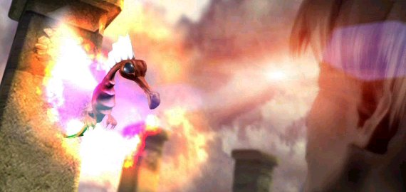
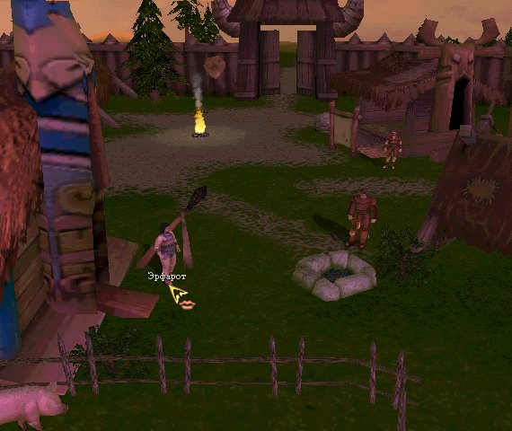
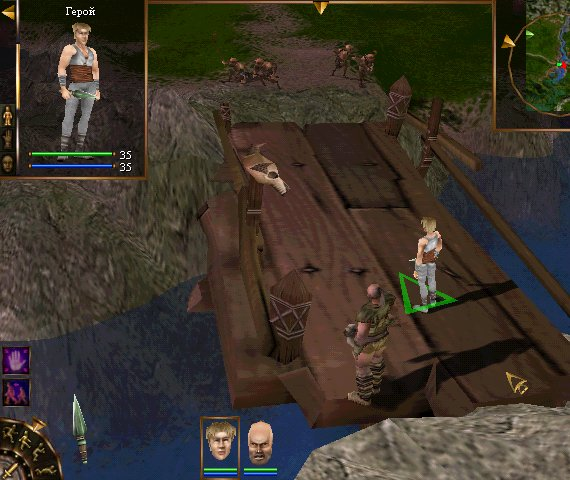
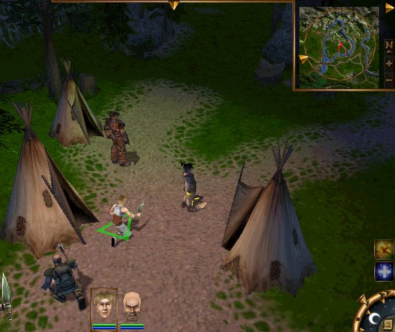
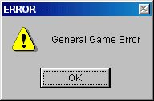

или "Поучительная история жизни, и удивительных приключений Злобного Юзера на Злобных Островах, описанная Злобным Разработчиком".

> [!NOTE] Алярм!
> статья в двух разных местах датирована по разному: мартом и июлем 2000 года. 
> 
> согласно [Отчёты](Отчёты.md), 23 марта 2000 - "Результаты плейтеста" на 1ч и "Большое обсуждение плейтеста" на 5ч
> 
> Исходя из этого:
> 
> март - время проведения плейтеста
> 
> июль - скорей всего дата написания статьи

«Проклятые Земли» вышли на финишную прямую, и в этом не только наша заслуга. Мы хотели бы отметить огромную роль, которую сыграли здесь наши бета-тестеры, и вынести им особую благодарность. Тестирование игры началось более чем полгода назад, и с тех пор в игру было внесено множество изменений к лучшему, которыми мы в большой степени обязаны нашим тестерам. История совместного творчества разработчиков и бета-тестеров, а теперь это действительно история, содержит в себе, как оказалось, массу забавных моментов. И если раньше нам, поглощенным доделкой и переделкой, было не до шуток, то теперь мы с удовольствием вспоминаем наиболее яркие эпизоды этой весны. Один из них, относящийся к самому началу тестирования и мастерски запечатленный по свежим следам нашим сценаристом Алексеем Свиридовым, мы предлагаем вашему вниманию.

_Типа эпиграф:  
1. Если что-то можно сделать неправильно, это будет сделано неправильно.  
2. Если что-то нельзя сделать неправильно, это все равно будет сделано неправильно.  
Закон Мэрфи.. Да что там Мэрфи! Закон природы._

  
  
Чем отличается плей-тест от бета-теста? Перефразируя известный анекдот, можно сказать так: бета-тест - это поиск ошибок в коде игры, а плей-тест - в ее ДНК Плей-тест - это попытка заранее узнать, что будет делать с игрою Его Величество Массовый Потребитель.  
  
Вообще-то говоря, Массовый Потребитель имеет много разновидностей, и охватить их всех нет никакой возможности. Да этого и не требуется: к примеру мы не рассчитываем на того Агрессивного Массового Потребителя, который засовывает выкупанную кошку в микроволновую печь, чтобы подсушить, или обрезает ножницами пятидюймовую дискету, чтобы она влезала в трехдюймовый флоповод. Этот - непобедим, и сумеет обойти любую защиту от дурака. Он взломает корпус компьютера стаместкой, оторвет у процессора лишние ноги кусачками, но все-таки вставит свежекупленный Дюрон в 486-ю мать.  
  
Есть и другой экстремальный вид, гораздо более распространенный и безобидный. Робкий Массовый Потребитель даже правильный диск в правильный дисковод не попытается вставить, если на диске не будет нарисована крупная стрелка с надписью "вставлять этой стороной, надписью вверх". А вставив, не вынет, если на самом дисководе над кнопочкой не будет надписи "Press for eject". Хотя, если кнопочка будет одна, он скорее всего ее все-таки нажмет, но вот если их будет две, то он позвонит в службу техподдержки, получит консультацию, но фирму-производителя дисковода запомнит, и больше никогда не купит ее продукцию, будь это хоть видак, батарейка для часов.  
  
Где-то между ними находится обычный массовый потребитель - человек не злой, но и не трусливый, честно старающийся научиться пользоваться тем, что попало ему в руки, и читающий инструкцию не позднее второго дня после начала попыток освоить новую покупку. Он с одной стороны не прочь поэкспериментировать, и не увидев красной кнопки, поискать и нажать зеленую, но с другой, если и зеленая кнопка не даст нужного результата, плюнет, и бросит это занятие.  
  
Мы не рассчитывали на экстремалов. Образно говоря, плей-тест и должен дать ответ, какого цвета какие надписи и какие кнопочки какой формы должны быть на нашей игре для того, чтобы Его Величество Обычный Массовый Потребитель не бросил нашу игру на полдороги.  
  
Мои чувства по отношению к нашему плей-тесту поначалу были скептическими. Эксперимент не казался мне чистым: в качестве "представителя заказчика" были приглашены будущие бета-тестеры, люди которые уже тестировали Аллоды-2, много играли и в другие игры. На мой взгляд от Массового Потребителя они отличались примерно так же, как матерый водила автолайновской "Газели" отличается от только что получившего права чайника, который два раза свозил тещу на дачу, причем на обратном пути простоял три часа в ожидании техпомощи по случаю соскочившего с катушки высоковольтного провода.  
  
Но все оказалось не так страшно - в том смысле, что все оказалось гораздо страшнее, чем ожидалось.  
  
Семь вечера - конец официального рабочего дня на фирме. В этот день хозяева компьютеров, на которых должно было проводиться тестирование, для разнообразия действительно покинули свои рабочие места ровно в это время, предварительно прибравшись на столах, и приведя десктопы в девственно чистый вид (Мой компьютер, Мои документы и EI). Примерно в это же время начали походить и… ну, наверное, "жертвами" их было бы назвать не политкорректно, и поэтому я про себя называл их "клиентами".  
  
Так вот, клиенты начали потихоньку собираться, и были усажены за чтение Соглашения о Неразглашении. Когда подошел предпоследний, четвертый тестер, (пятого решили не ждать, и правильно сделали, потому что он явился около восьми), Орловский произнес краткую речь. В ней были все полагающиеся случаю слова благодарности, добрые напутствия и, на всякий случай, средней прозрачности намеки о печальной участи того, кто несмотря на Соглашение все-таки что-то такое разгласит, предварительно не согласовав с нами. Клиенты кивали, и задавали каверзные вопросы - а можно ли разглашать с женой в постели (к сведению интересующихся - "Можно, но шепотом" © С.Орловский).  
  
Система предполагалась такая: тестера сажают за машину, а рядом сажают ниваловца с бумажкой, который должен молча наблюдать за процессом поиска Нужной Кнопочки, и записывать, где эти поиски тянутся слишком долго. Какая-то помощь тестеру изначально не предусматривалась.  
  
Из всех клиентов я выбрал молодого паренька, которого знал по аллодовскому серваку как весьма неплохого геймера. Сам собой, что выбрал я его не просто так, а в тайной надежде, что он не будет тратить время на освоение каких-то простейших вещей, а сразу же вскроет некие глубинные недостатки, до которых остальные попросту не доберутся. Некоторое время мы с ним смущенно (попрошу без намеков!) улыбались друг другу, а потом я с усилием сделал каменное лицо, и препроводил тестера к компу. Проблемы с поиском и нахождением иконки не возникло, Злобные Острова благополучно запустились, и пошел ролик-интро.  

==Ролик-интро==

Первым движеним клиента было включить колонки. Потом увеличить звук. Потом я зарегистрировал позыв прервать полезть в настройки компа, чтобы таки заставить подлую Винду играть озвучку. Пришлось нарушить обет молчания, и объяснить, что озвучки в интро пока что нет, а потом звуки будут… Я не обманул клиента, "потом" звуки и вправду появились, да с такой силой, что пришлось выкрученные на максимум колонки наоборот, приглушить.  
  
Версия для плейтеста была настроена так, что Герой игры появлялся в развалинах, мог сделать несколько шагов к выходу из них, и тут же переносился в поселок. У любого из нас, кто садился за версию, этот процесс занимал секунд пять. Но клиент уже с первой минуты решил продемонстрировать, что плейтест мы задумали не зря…  
  
Для начала он долго не мог заселектить персонажа. То есть он щелкал мышкой по всему экрану, но в персонажа не попадал - оказывается, мы мудро выставили камеру так, что в начале игры Герой спрятан за листвой дерева, а какой нормальный человек будет кликать в дерево, чтобы заселектить персонажа? [1](Плейтест.%20Как%20много%20в%20этом%20звуке…%20(март%202000).md#^35a1e0) Но через минуту-другую клиент все таки сумел взять управление в свои руки и повел Героя… Нет, не к выходу. Для начала добрый тестер повел беднягу к обрыву, однако кидаться с обрыва в бурные волны Герой отказался, после чего был послан на гору. Но лезть наверх Герою оказалось тоже в ломы, и первый раунд "Игра-Потребитель" закончился в нашу пользу: клиент все-таки вывел Героя из развалин, перенесся в поселок, и получил первый (автоматический) диалог, каковой прочитал очень внимательно.   ^781246

==База на Гипате==

Так же внимательно он читал и все остальные тексты. Правда перед этим он некоторое время пытался найти среди людей, стоящих в поселке Героя (не нашел) [2](Плейтест.%20Как%20много%20в%20этом%20звуке…%20(март%202000).md#^35a1e0), полетать камерой (камера осталась неподвижной) [3](Плейтест.%20Как%20много%20в%20этом%20звуке…%20(март%202000).md#^35a1e0), вызвать Esc-меню (не вызвалось) и, наконец, залезть в инвентарь Героя (инвентарь не открылся).  
  
Что же касается диалогов, то первым персонажем, на котором курсор принял форму игривых губок [4](Плейтест.%20Как%20много%20в%20этом%20звуке…%20(март%202000).md#^35a1e0), была свинья, с каковой и произошла содержательная беседа. ("Пшла вон! - Хрю-хрю, Уи-и-и!"). Клиент был обрадован, и пошел разговаривать с остальными персонажами, в результате чего обогатился кучей сведений про остров Гипат, взял наемника Забияку и получил два первых задания в Предгорьях. Так же ему было рассказано, что есть мол такая знахарка Эстера, которая поселковых к себе не пускает, и к ней просто так не пройти.  
  
Итак, клиент вышел из поселка, и наконец-то, на глобальной карте, нашел обоз, а в нем - свое имущество! (Хотя бы для Героя. Переключиться с Героя на наемника он так и не сумел.)  
  
Счастье клиента было столь велико, что он первым делом раздел Героя до нижнего белья и сделал ехидное замечание по поводу проглядывающих из-под трусов анатомических подробностей (на самом деле это был всего лишь баг модели, а вовсе не то, что он подумал, но смотрелось именно так). После этого клиент одел Героя обратно, и уразумел, что вещи, снятые с тела, но оставшиеся у Героя в распоряжении, кладутся на НИЖНЮЮ линейку. И с полной уверенностью, что делает все правильно, перенес свое единственное оружие - металлический нож - с ВЕРХНЕЙ линейки тоже вниз, оставив таким образом Героя безоружным перед многочисленными опасностями.  

[Глобальная карта Гипата (плейтест)](../shots/detailed/Глобальная%20карта%20Гипата%20(плейтест).md)

  
Выполнив это действие, наш тестер вышел обратно на глобальную карту, и задумчиво поводил курсором между двумя зонами ("Предгорья", где у него было два задания и "Дорога к знахарке", где заданий не было, но было описание, мол там все плохо). Почитав описания зон, он пошел …  
  
Да, да, вы конечно же угадали! Клиент направил свою группу именно в зону "Дорога к знахарке", где и продолжил увлекательные приключения в мире злых островов. Первые шаги в сторону знахаркиной пещеры прошли гладко: Герой под мудрым руководством клиента подрался с кабанами, и завалил одного голыми руками (двух других прикончил наемник Забияка).  
  
Но дальше стало хуже: в течении сорока минут Герой погибал самыми разнообразными способами - клиент, летая на нашей "свободной камере" словно Пауэрс на своем U-2, обнаружил вход в пещеру Знахарки, и стремился к ней как стадо леммингов на другой берег фьорда. Само собой, что его ожидал тот же финал, что и настойчивых грызунов, только лемминги не умеют сейвиться. Когда же пошла сорок первая минута этой трагедии, я не выдержал и тихо (чтобы руководитель проекта не слышал) прошептал, что не худо бы пойти в другую зону, где есть задания, и подсказки по их выполнению.  
  
И клиент пошел туда, где есть задания и подсказки. Нет, я, как автор текстов, не слагаю с себя ответственности: действительно, можно было бы написать и понятнее. Но честное слово, я до сих пор просто не мог себе представить, что мои творения можно воспринять ТАК… Судите сами: вот цитата непосредственно из ресурсов игры:  
  
"Лагерь разбойников находится на севере, между двумя рукавами реки у подножья гор. Прямая дорога туда ведет через мост, который всегда находится под сильной охраной. Гораздо проще пробраться к лагерю через брод в верховьях: эта дорога более длинная, но брод охраняется гораздо слабее".  

==Мост с гоблинами==

  
И как вы думаете, куда пошел клиент, прочитав этот текст? Правильно, прямой дорогой, бормоча себе под нос: "Так, ну и где же этот мост?" - впрочем, до "этого", разбойничьего моста он не дошел, хватило и гоблинской заставы в самом начале дороги. Так что вновь мне пришлось нарушить обет молчания, попросить тестера прочитать подсказку ДО КОНЦА - и только тогда Герой сумел добраться до разбойничьего лагеря без фатальных приключений.  
  
А вот около лагеря у клиента случилась новая заминка, и за нее мне (повторяю - автору текстов) упрекать уже некого, кроме себя самого. Задание было кратким: завладеть вещами атамана и его толстухи-супруги. То есть когда-то подразумевалось, что игрок сам должен решить: то ли убивать атаманское семейство подлым ударом в спину, то ли тихохонько обчистить его карманы, и по-пластунски слинять на безопасное расстояние.  
  
Но с тех пор утекло немало воды, настройки игры изменялись раз …дцать, да и концепция тоже успела пару развернуться "ко мне задом, к лесу передом" и обратно. На нынешний момент убить атамана практически невозможно, и кража - единственный выход.  
  
Но: нигде - ни в текстах, ни во всплывающих подсказках о принципиальном существовании в игре возможности что-то украсть у живого персонажа не упоминается! Я это понял лишь в момент, когда клиент приблизился к Атаману - вот что значит "замыленность глаза" разработчика. Пришлось в очередной раз изменить суровому и молчаливому образу, навести курсор на иконку "украсть/использовать" - и тут же покраснеть от стыда, увидев всплывшую подсказку "Ловкость рук" (Так я обозвал характеристику, отвечающую за воровство и использование всяческих механизмов).  [5](Плейтест.%20Как%20много%20в%20этом%20звуке…%20(март%202000).md#^35a1e0)

==Инструменты==

  
Таким образом пришлось в качестве подсказки поработать самому, и по-быстрому объяснить, что за иконка, и как пользоваться режимом. Клиент, надо сказать, освоил операцию "тайного завладения чужим имуществом" (ст. 121 УК РСФР) быстро, и вскоре Герой с выкраденными вещами, и выполненным заданием отправился домой, в поселок. Там его с распростертыми объятиями ждал Мастер - персонаж, который должен был в знак признательности за совершенную кражу выдать Герою возможность пользоваться магазином и конструктором предметов.  
  
Тут, надо признаться, я затаил дыхание - потому что на освоение этого режима я сам в свое время потратил очень много времени, как своего, так и создателей этого удивительного инструмента. Они, создатели объясняли мне, что интерфейс прост как дважды два и сердились на то, что я не понимаю совершенно элементарных вещей. Например, что строчка мелкими буквами, выводящаяся над суммой денег у Героя в левом-не-совсем-нижнем углу - это название экрана. Действительно, ну что может быть элементарней…  
  
Клиент оказался полностью со мной согласен. Правда, он не сказал этого вслух, но устроил молчаливую демонстрацию протеста и солидарности, всеми своими действиями показывая, что ему тоже непонятна необходимость нажать на ма-а-а-аленькую пимпочку-галочку для того, чтобы подтвердить распределение экспов. Действительно, зачем это делать, когда цифирки так наглядно меняются, подчиняясь щелчку мышки… А то, что после перехода на другой экран с нещелкнутой галочкой все сбрасывается в "первобытное" состояние - так об этом ведь никакой информации и не выводится!  [6](Плейтест.%20Как%20много%20в%20этом%20звуке…%20(март%202000).md#^35a1e0)

[Конструктор заклинаний, март 2000](../shots/detailed/Конструктор%20заклинаний,%20март%202000.md)

  
Ну, и конечно же, "момент замрите мухи" - это использование конструктора. У меня язык не повернется рассказать, а пальцы напечатать то, что несчастный тестер вытворял с материалами, прототипами и экранами в надежде собрать гранитный топор… Признаюсь (mea culpa!), что на десятой минуте борьбы "интерфейс-клиент" я снова не выдержал, и вмешался в борьбу титанов. И надо сказать, угрызений совести отнюдь по этому поводу не чувствовал: вряд ли еще десять минут (двадать, пятдесят, два часа) сделали бы более ясным то, что интерфейс малопонятен. [7](Плейтест.%20Как%20много%20в%20этом%20звуке…%20(март%202000).md#^35a1e0)
  
Клиент обрадовался, и с гранитным топором наперевес отправился на поиски новых приключений… Но увы: караул устал. Игрушка упала раз, потом другой, потом третий-четвертый-пятый… Словом, Злобные Острова на пару с двухтысячной Виндой не выдержали трех часов брождения клиента подряд, и объявили итальянскую забастовку, озадачив тем самым и так уже морально надломленных вскрывшимися непонятками разработчиков. [8](Плейтест.%20Как%20много%20в%20этом%20звуке…%20(март%202000).md#^35a1e0)

==Генерал Гаме Еррор==

Словом, плейтест закончился. Клиенты ушли в общем-то довольные, а мы остались, в общем-то недовольными. Не клиентами, собой: вдруг оказалось, что множество мест в игре требуют доработки, если не коренной переделки. Причем большая часть их этого в общем-то лежала на поверхности, и достаточно было бы поставить себя на место пользователя, который…  
  
Однако я не зря уже использовал разок термин "замыленный глаз". Тот, кто по сто двадцать восьмому (или двести пятьдесят шестому) разу проходит одну и ту же зону, а потом лезет в один и тот же конструктор вряд ли способен действительно поставить себя на место того самого Массового Потребителя, который в конечно счете получит нашу игру.  
  
И поэтому - да простят мне плейтестеры, и лично мой клиент все подначки и всю иронию, с которой я рассказал об их похождениях. На самом деле их ошибки - это наши ошибки, и очень хорошо, что они были тогда, когда их еще возможно исправить. Я совершенно честно хочу сказать: огромное вам спасибо. Мы постараемся, чтобы следующим тестерами было легче… И надеюсь, что они постараются, чтоб нам было тяжелее.  
  
Когда у нас следующий-то плейтест? Что-то будет…  
  

_А. Свиридов AKA CMEPTHIK, март 2000 года._

А.Свиридов AKA CMEPTHIK, июль 2000 года.

---

|                   |                                                                                                                                                                                                                                                                                                                                       |
| ----------------- | ------------------------------------------------------------------------------------------------------------------------------------------------------------------------------------------------------------------------------------------------------------------------------------------------------------------------------------- |
| [1](#^781246)  | По результату плейтеста было сделано так, чтобы герой, или же кто-то из его команды был выбран всегда. «И это пгавильно, товагищи!»                                                                                                                                                                                                   |
| 2                 | Теперь его найти можно.                                                                                                                                                                                                                                                                                                               |
| 3                 | Теперь ею можно летать.                                                                                                                                                                                                                                                                                                               |
| 4                 | От курсора в виде «губ» отказались — слишком вольные ассоциации он вызывал. Впрочем, лично я об этом даже жалею, и ровно по тому же поводу.                                                                                                                                                                                           |
| 5                 | По результатам плейтеста была разработана и внедрена система обучающих экранов, в которых буквально на пальцах объясняется, как пользоваться возможностями игры. Последующие «опыты на людях» показали, что это действительно помогает, так что — будущие игроки! Читайте обучающие экраны. Как говорят братья-фидошники — это рулез. |
| 6                 | С тех пор интерфейс был переделан, и не раз. Опять же для каждого его элемента введен обучающий экран.                                                                                                                                                                                                                                |
| 7                 | В продолжение сноски 6: господа игроки! Если вам что-то неясно — жмите кнопку «Н» (латинское). Она не укусит, честное слово...                                                                                                                                                                                                        |
| 8                 | Надеюсь, все понимают, что с того далекого времени, когда прошел этот плейтест, наши программеры не сидели сложа руки?                                                                                                                                                                                                                |

^35a1e0
