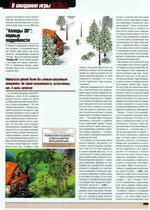

TODO: дополнить + цитирование

# общие детали

Название: Аллоды 3D

Дата выхода: конец 1999 года

# сюжет

Приключения начинаются, когда на один из отдалённых аллодов отправляется экспедиция. Прибыв на место, любители острых ощущений довольно быстро выясняют, что сей аллод "жутко запущен" (меткое авторское определение). Подавляющую часть его населения составляют орки и гоблины, а немногочисленные человеки вынуждены трусливо скрываться. В ходе разведки боем вы узнаете, что здесь все-таки существуют два достаточно мощных людских форпоста. Но добраться до них, увы... В общем, к тому моменту, когда заканчивается intro, из всей группы в живых остаётся лишь один человек. Вы. Вернуться домой было бы самым разумным решением. Но такой возможности, естественно, нет. А жить хочется! Здравствуй, племя молодое, незнакомое.

Впрочем, выживание не есть конечная цель. Сюжетная линия игры предусматривает сразу несколько вариантов развития событий. Согласно одному из них, вы сможете обосноваться на "запущенном" аллоде (постройка базы будет первым к тому шагом, но об этом чуть ниже).
Не хотите быть столяром и плотником?
Тогда вам предстоит длительное скитание по различным аллодам в поисках родного дома. Разумеется, придётся нелегко, - эти аллоды будут отличаться и населением, и культурой, и климатом.