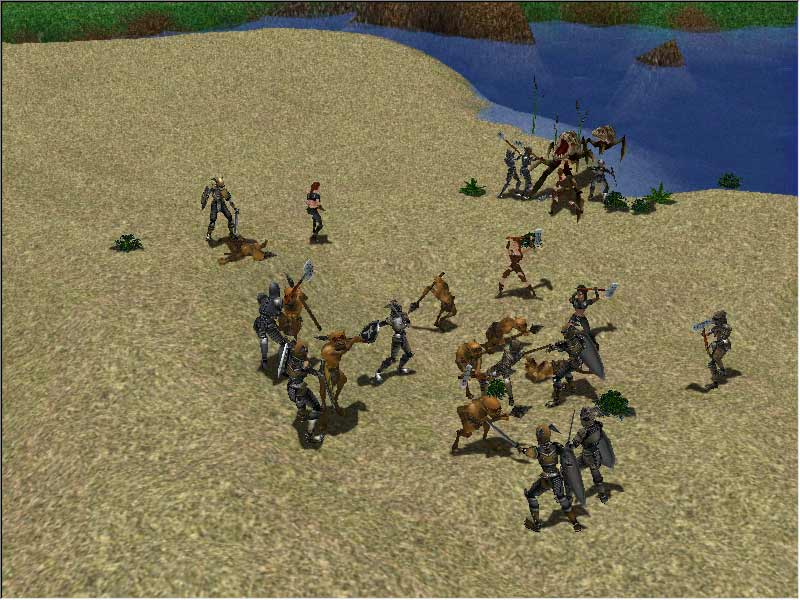
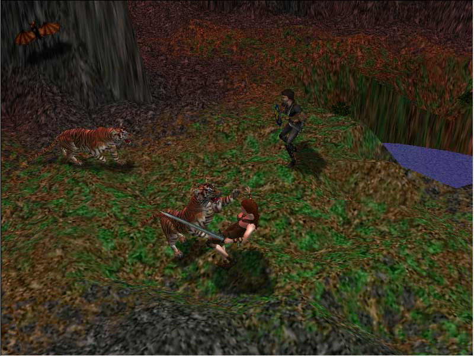
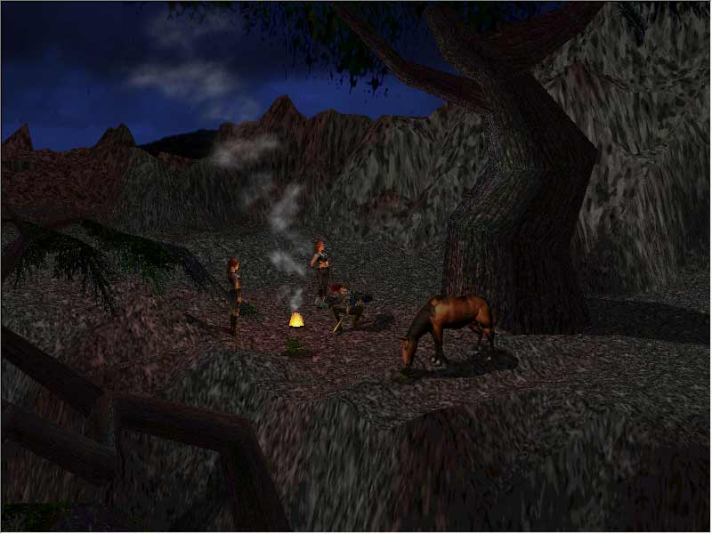

> [!NOTE] Алярм!
>  По видимому, текст и скриншоты в статье немного разного периода. Текст статьи самодатируем 2 декабря 1998. Колонка журнала "От редактора" - 20-22 декабря: "За окошком - самая длинная ночь уходящего года"
> 

Предоставленная информация соответствует планам Nival на 2 декабря 1998 года

Пока существует только несколько тестовых зон, на которых обкатывается графическое ядро. Это **берег реки**, **город** и **заснеженная равнина**.

В городе уже можно читать объявления и надписи на домах, вести беседы с местными жителями.

У реки можно понаблюдать, как волшебник убивает гоблина огненным шаром.

[Битва на песчаном берегу (преальфа)](../../shots/detailed/Битва%20на%20песчаном%20берегу%20(преальфа).md)

[Драка с тиграми (преальфа)](../../shots/detailed/Драка%20с%20тиграми%20(преальфа).md)

[Привал в горах (преальфа)](../../shots/detailed/Привал%20в%20горах%20(преальфа).md)

