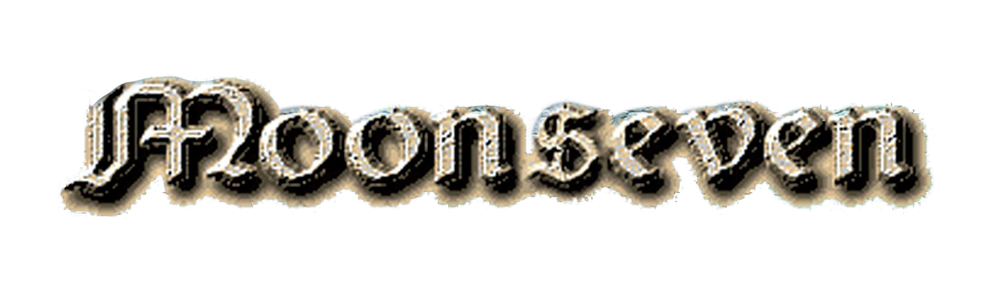
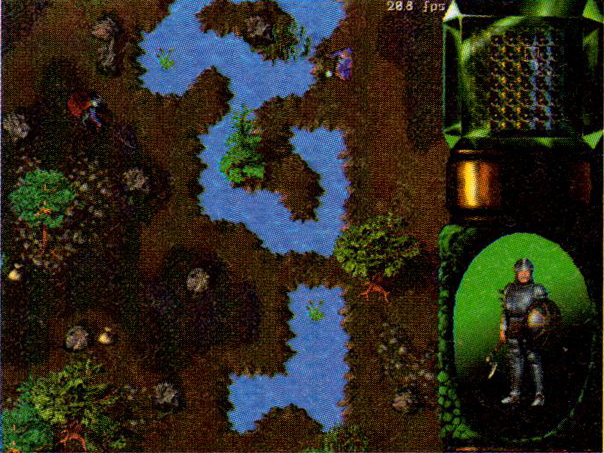
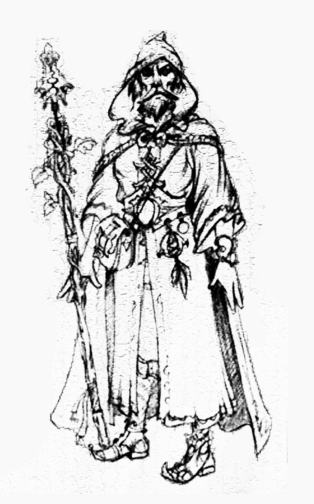
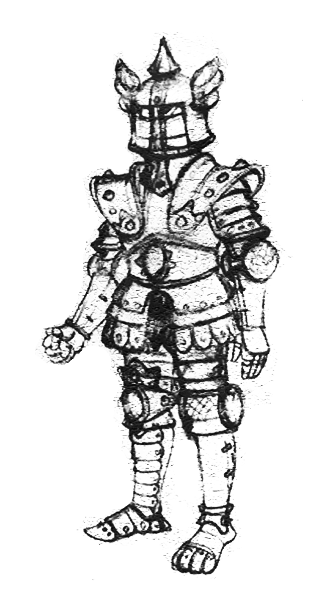
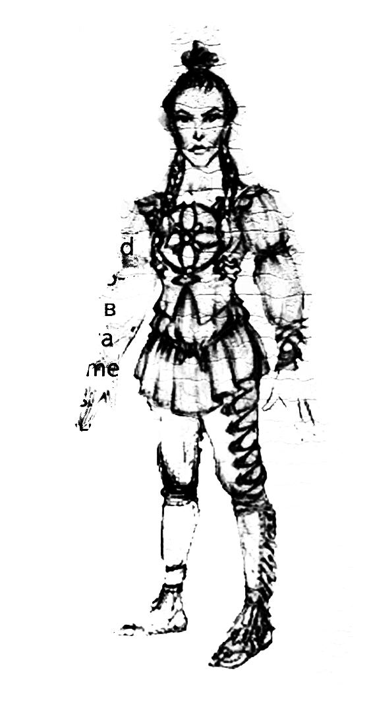
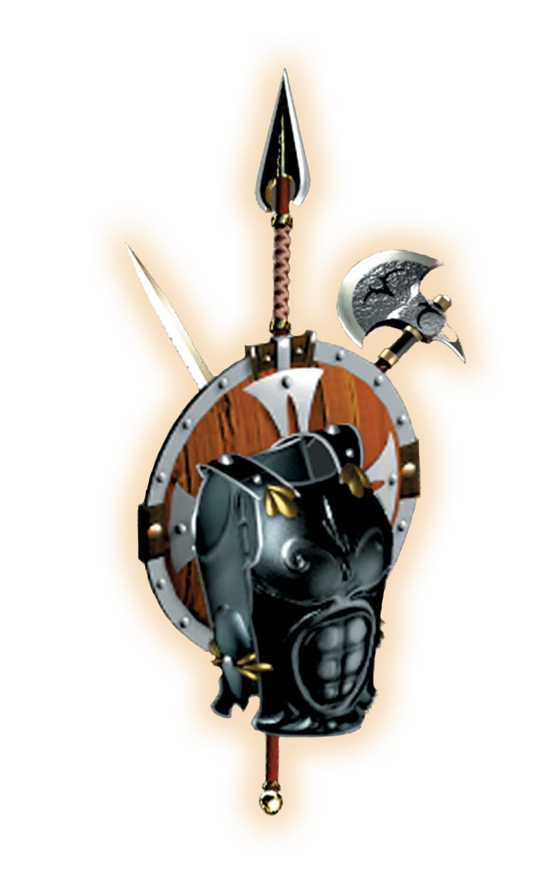

**Тема: Стратегия в реальном времени с элементами RPG**

**Издатель: Бука**

**Выход: Зима 1997-98 гг.**

В настоящее время компания Nival Enterta-inment разрабатывает для компании Buka компьютерную игру с рабочим названием Moonseven. Она представляет собой стратегию в реальном времени с элементами ролевой игры. Весь проект рассчитан на создание двух версий: однопользовательской и многопользовательской. Архитектура, идеология и игровой дизайн Moonseven ориентированы на глобальную многопользовательскую версию в сети Интернет, а однопользовательская - это построение интересной игры для одного игрока на тех же самых законах мира.

Одна из основополагающих идей игрового дизайна состоит в привнесении качества графики ролевой игры в стратегию, создании богатого и красивого видео- и звукового ряда. Moonseven пишется с учётом самых передовых подходов дизайна стратегических игр и использованием новейших технологий, она соединяет в себе элементы широко известных WarCraft II и Diablo.

Среди её особенностей можно выделить такие компоненты, как функциональные, изометрические, трёхмерные ландшафты с расчетом освещенности по алгоритму Гуро, богатый фэнтезийный мир и большое количество 3D моделированных prerendered персонажей с отличным движением и анимацией и с возможностью переодевания. Вывод prerendered персонажей со сглаживанием с использованием альфа-канала является одной из важных технологических разработок. Prerendered персонажи однопользовательского варианта в версии для Интернета заменятся на real-time rendered 3D characters.

Создаётся мощный искусственный интеллект компьютерных оппонентов, аналогов которому в настоящее время не существует. Игра изобилует красивыми анимационными вставками, развивающими оригинальный сценарий, построенный на принципах классического фэнтези и погружающий игрока в героико-романтическую атмосферу совершенной магии и великих подвигов.

Вместе с игрой планируется поставлять редакторы карты и редакторы миссий для конечных пользователей.

Этот проект разрабатывается для Windows95/NT в разрешении 640x480 HighColor с использованием таких передовых технологии, как DirectX и MMX (рекомендуется). Также разрабатываются и используются собственные оригинальные технологии, такие, как технология трёхмерных ландшафтов NivaLand, технология сглаживания Alpher и др. Работа ведется опытными российскими разработчиками, участвовавшими в следующих проектах: Sea Legends (Ocean - 96), Total Control (Software 2000 - 96), Trevoga (to be published) и Russian Six Pak (Interplay 94).

Однопользовательская версия будет завершена в ноябре 1997 года. Дата выхода многопользовательской версии - 3-ий квартал 1998 года.

В одном из следующих номеров мы более подробно расскажем о Moonseven.

|  |  |  |
| --------------------------------------------------- | --------------------------------------------------- | --------------------------------------------------- |

