Введение:
Собирал Atm
Спасибо:
Дмитрий Носов - за рендеры некоторых вещей и объектов
MorgenS, Nik Zh, Oleg Diablo, Павел Шатов - за помощь в рисёрче

# Объекты

|                                                                                      |                                                   |
| ------------------------------------------------------------------------------------ | ------------------------------------------------- |
| barrel00 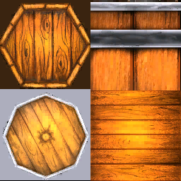 box00 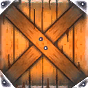 | moneysack00 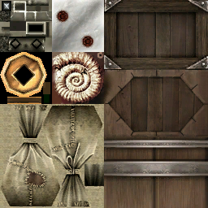 |
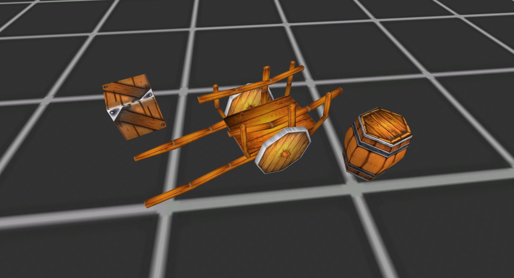

|                                                                                                    |                                                   |
| -------------------------------------------------------------------------------------------------- | ------------------------------------------------- |
| shop00  blacksmith00 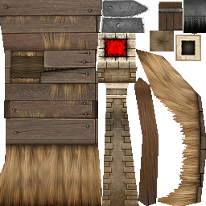  | bigshop01   |

### Природа

|                                                                                                                                                                                                          |     |
| -------------------------------------------------------------------------------------------------------------------------------------------------------------------------------------------------------- | --- |
| bush03 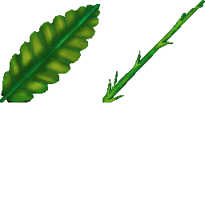 bush03a  bush03d                                      |     |
|  bushset01 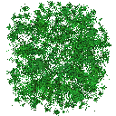 bushset02  bushset03  bushset04 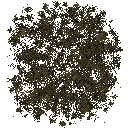  |     |
|                                                                                                                                                                                                          |     |

### Разные

# Юниты (Люди, Звери, Монстры, ...)

### Разные

#### Птицы

| Allods3                                                                                                              | Etherlords 1                                              | Evil Islands                                                            |
| -------------------------------------------------------------------------------------------------------------------- | --------------------------------------------------------- | ----------------------------------------------------------------------- |
| eagle00    | eagle00  | hadoganstatues00 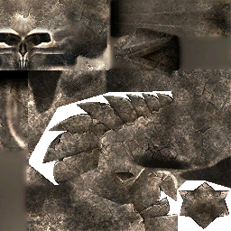  |
| bird                                               |                                                           | (quest complete) bird00     |
#### Fungus
В базе данных расы **`Fungus`** и **`Fungus 2`**
TypeId = 51 - Монстр
Locomotion = 3 - только у него, соответствует строке в текстах **`(Стоит)`**

| Модель  | Текструра    |
| ------- | ------------ |
| unmomu1 | Mushroom01_1 |
| unmomu2 | Mushroom02_1 |
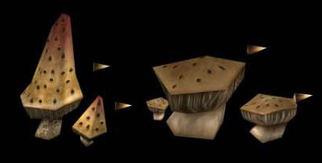

#### Проклятье

Текстуры curse00 и curse01 отличаются в различных мелочах и тонах.
Обе имеют надпись (подпись?)
> TIER-NIVAL
> 2000

| Unused                                              | Used                                            |
| --------------------------------------------------- | ----------------------------------------------- |
| curse01 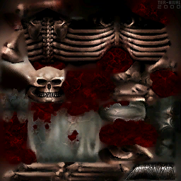  | curse00 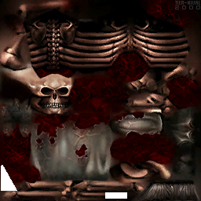 |

curseAltar00 - черновая UV текстура для монстра, появляющегося из плиты в катсцене после титров.

Упоминается в unmoco4.adb (19.06.2000?): анимации cidle01, cidle02, uspecial01

| Unused                                              | Used                                               |
| --------------------------------------------------- | -------------------------------------------------- |
| cursealtar00  |  |

curseArms00 - ??? руки проклятья?

Упоминается в unmoco3.adb (19.06.2000?): анимации cidle01, cidle02, uspecial01

### Портреты

#### монстры

|                                                                                                                                                                 |                                                  |
| --------------------------------------------------------------------------------------------------------------------------------------------------------------- | ------------------------------------------------ |
| orc_face 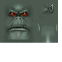 face_lizardman00 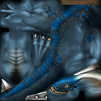 face_wolf00 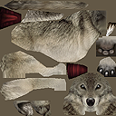 |  |

#### люди

|                                      |                                         |     | Demo                                           | Release                                       |
| ------------------------------------ | --------------------------------------- | --- | ---------------------------------------------- | --------------------------------------------- |
|      | face00 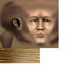 |     | facem00 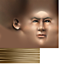 | facem00 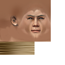  |
| 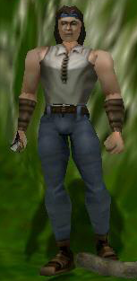 |                                         |     |                                                |                                               |
|   |                                         |     |                                                |                                               |
| 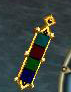   |                                         |     |                                                |                                               |

|                               |                                                  |
| ----------------------------- | ------------------------------------------------ |
| 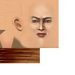 |                    |
| 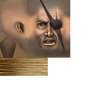 |                    |
|  |                    |
| 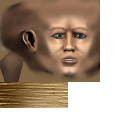 |                                                  |
| 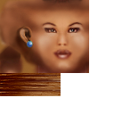 | 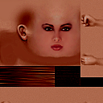 |

| Unused skins                                                                                                                                                                                                                                                         |
| -------------------------------------------------------------------------------------------------------------------------------------------------------------------------------------------------------------------------------------------------------------------- |
|    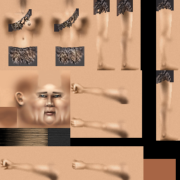  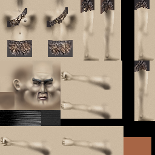    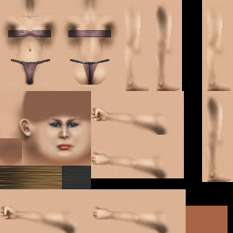  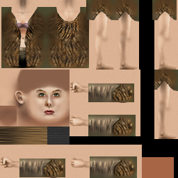 |

# Предметы
### Оружие

|                                                                                                                                                                                                                                                                                                                                                                                                |                                                             |
| ---------------------------------------------------------------------------------------------------------------------------------------------------------------------------------------------------------------------------------------------------------------------------------------------------------------------------------------------------------------------------------------------- | ----------------------------------------------------------- |
| goblinaxebag00 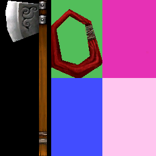  Узор на скрине и текстуре отличаются,  скриншотов с итоговым орнаментом пока нет.   (держит двумя руками в паре кадров?)      |                                                             |
| goblinswordbag00                                                                                                                                                                                                                                                                                                                               | unhumasw_02.st.0 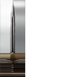 |
| goblinslingbag00                                                                                                                                                                                                                                                                                                                               | goblin00            |

### Броня

### Щиты

|                                                                                                                                                               |     |
| ------------------------------------------------------------------------------------------------------------------------------------------------------------- | --- |
|  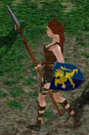 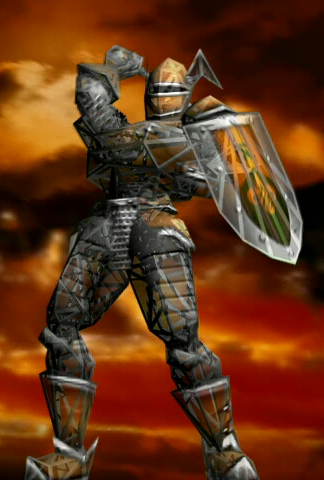 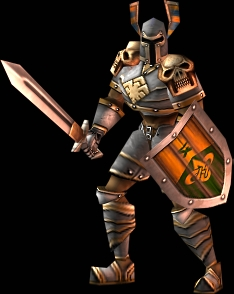  |     |
| 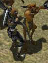 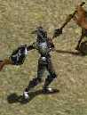                                                                   |     |
| 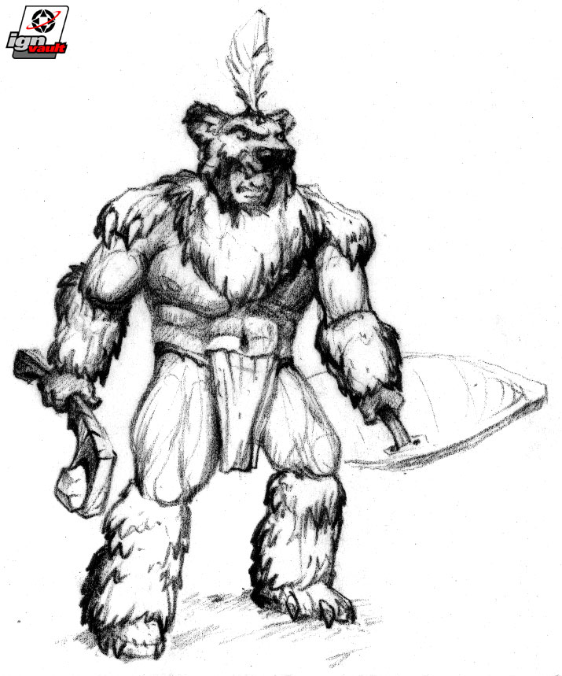   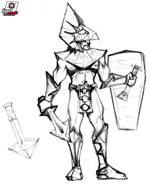                                  |     |

### Квестовые

### Используемые (Ключи, Зелья, ...)

### Основное

Какие то из этих индексов - ловушки, отмычки, ломы.

| Idx | DB: ItemID | DB: Type     | Name`s                        | Тексты                               |
| --- | ---------- | ------------ | ----------------------------- | ------------------------------------ |
| 0   | 0          | dangersensor | danger sensor                 | Кристалл                             |
| 1   |            |              |                               |                                      |
| 2   |            |              |                               |                                      |
| 3   |            |              |                               |                                      |
| 4   |            |              |                               |                                      |
| 5   | 5          | wand         | wand                          | Жезл <...>                           |
| 6   |            |              |                               |                                      |
| 7   |            |              |                               |                                      |
| 8   | 8          | scroll       | potion  spell container | Свиток <...>  Нечто магическое |

#### Ловушки
каменная (4 материалов) - Гипат
костяная (7 материалов) - Гипат
металл (6 мат) - Ингос?
металл (6 мат) вид2 - Суслангер?

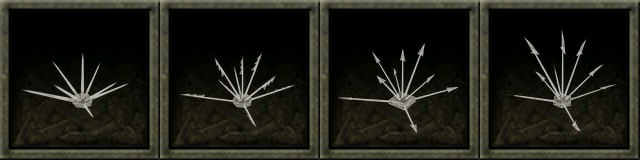

#### Отмычки
> **p SetScience (o1 f1 f2 f3 f4 f5 f6)** – Установить новые параметры управляющие переключением рычагов для объекта **o1**, **f1** – ID квестового ключа, **f2** - скилл в ловкости рук, требуемый для открывания двери, **f3** – открывается ли дверь руками (0 – открывается, 1 - нет), **f4** – открывается ли дверь отмычками (0 – открывается, 1 - нет), **f5** – открывается ли дверь ломом (0 – открывается, 1 - нет), **f6** – открывается ли дверь ключом (0 – открывается, 1 - нет).
(https://allods.gipat.ru/index.php?p=eimodzconsolenival)

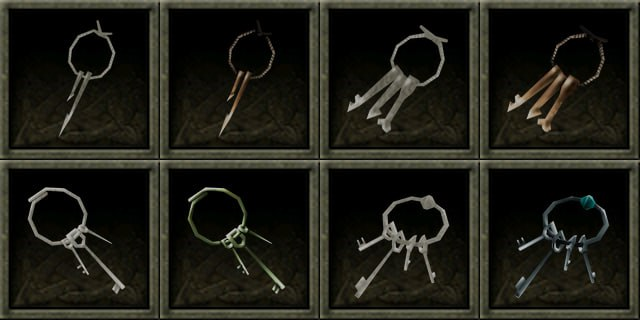

#### Ломы
> **p SetScience (o1 f1 f2 f3 f4 f5 f6)** – Установить новые параметры управляющие переключением рычагов для объекта **o1**, **f1** – ID квестового ключа, **f2** - скилл в ловкости рук, требуемый для открывания двери, **f3** – открывается ли дверь руками (0 – открывается, 1 - нет), **f4** – открывается ли дверь отмычками (0 – открывается, 1 - нет), **f5** – открывается ли дверь ломом (0 – открывается, 1 - нет), **f6** – открывается ли дверь ключом (0 – открывается, 1 - нет).
(https://allods.gipat.ru/index.php?p=eimodzconsolenival)

Фанфакт: Двусторонний каменный лом используется в качестве рычага в квесте Ящера-Отшельника.

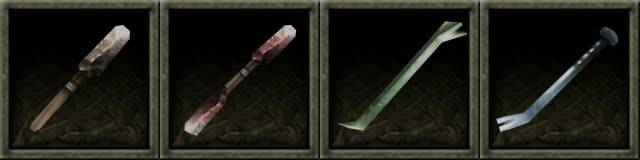

# Магия
### Модификаторы

|                                                                                                                                                                                                                               |                                                 |
| ----------------------------------------------------------------------------------------------------------------------------------------------------------------------------------------------------------------------------- | ----------------------------------------------- |
| mod0000  mod0001  mod0002  mod0003  mod0004  |                                                 |
| modifiers 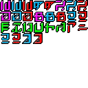                                                                                                                                                                                 | modifiers2  |

### Спеллы

| Idx | Id Name                       |                                                      | Icon                                    | In-game text                                                               |                                                                                                      |
| --- | ----------------------------- | ---------------------------------------------------- | --------------------------------------- | -------------------------------------------------------------------------- | ---------------------------------------------------------------------------------------------------- |
| 0   | Fire Arrow                 |                                                      | 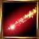 |                                                                            |                                                                                                      |
| 1   | Lightning Arc              |                                                      | 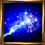 |                                                                            |                                                                                                      |
| 2   | Acid Ray                   |                                                      |  |                                                                            |                                                                                                      |
| 3   | Fireball                   |                                                      | 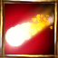 |                                                                            |                                                                                                      |
| 4   | Invoke Lightning           |                                                      |  |                                                                            |                                                                                                      |
| 5   | Column of Acid             |                                                      | 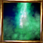 |                                                                            |                                                                                                      |
| 6   | Wall of Fire               |                                                      | 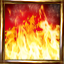 |                                                                            |                                                                                                      |
| 7   | Smtg Lightning             |                                                      |  |                                                                            |                                                                                                      |
| 8   | Acid Fog                   |                                                      |  |                                                                            |                                                                                                      |
| 9   | Protection from Fire       |                                                      |  |                                                                            |                                                                                                      |
| 10  | Protection from Lightning  |                                                      | 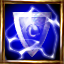 |                                                                            |                                                                                                      |
| 11  | Protection from Acid       |                                                      |  |                                                                            |                                                                                                      |
| 12  | Eagle Sight                |                                                      |  |                                                                            |                                                                                                      |
| 13  | Infravision                |                                                      |  |                                                                            |                                                                                                      |
| 14  | Detect Life                | spell0014 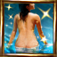 |                                         |                                                                            |                                                                                                      |
| 15  | Invisibility               |                                                      |  |                                                                            |                                                                                                      |
| 16  | Silence                    |                                                      |  |                                                                            |                                                                                                      |
| 17  | Lichdom                    |               |                                         |                                                                            |                                                                                                      |
| 18  | Fireworks                  |                                                      | 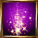 |                                                                            |                                                                                                      |
| 19  | Stench                     |               |                                         |                                                                            |                                                                                                      |
| 20  | Clairvoyence               |                                                      |  |                                                                            |                                                                                                      |
| 21  | Possession                 | spell0021  |                                         |                                                                            | Обзор глазами цели                                                                                   |
| 22  | Shapechange                | spell0022  |                                         |                                                                            | Превращение в моба по руне?  Допускает руны fh,fg,fo,fl Цель s (self? нет других таких)  |
| 23  | VisionFog                  |                                                      |  |                                                                            |                                                                                                      |
| 24  | Healing                    |                                                      |  |                                                                            |                                                                                                      |
| 25  | Stun                       |                                                      |  |                                                                            |                                                                                                      |
| 26  | Antimagic                  |                                                      |  |                                                                            |                                                                                                      |
| 27  | Link                       | spell0026  |                                         | Link Allows two spell casters to link their reserves of magical energy. | Обмен стаминой с некоторой её тратой                                                                 |
| 28  | Teleport                   |                                                      |  |                                                                            |                                                                                                      |
| 29  | Strengthen                 |                                                      |  |                                                                            |                                                                                                      |
| 30  | Weaken                     |                                                      |  |                                                                            |                                                                                                      |
| 31  | Regeneration               |                                                      |  |                                                                            |                                                                                                      |
| 32  | Feeblemind                 |                                                      |  |                                                                            |                                                                                                      |
| 33  | Speed                      |                                                      |  |                                                                            |                                                                                                      |
| 34  | Slow                       |                                                      |  |                                                                            |                                                                                                      |
| 35  | Comprehend                 |               |                                         |                                                                            | ???? "Понимать" кого то?  Допускает руны fh,fg,fo,fl Цель unit                     |
| 36  | Charm                      | spell0035  |                                         |                                                                            | Приручение  Допускает руны e0,e1,e2 (эффект) Цель unit                                      |
| 37  | Enlarge                    |               |                                         | Увеличение Увеличивает размеры того, на кого наложено.                  |                                                                                                      |
| 38  | Shrink                     |               |                                         | Уменьшение Уменьшает размеры того, на кого наложено.                    |                                                                                                      |
| 39  | Campfire                   |                                                      |  |                                                                            |                                                                                                      |
| 40  | Rick Magic                 |                                                      |  |                                                                            |                                                                                                      |
| 41  | Curse Magic                   |                                                      |  |                                                                            |                                                                                                      |

### Навыки и умения

Из текстов:

stealing
> Воровство
> Искусство воровства.

tame
> Приручение
> Приручение.

science
> Ловкость рук
> Навык, позволяющий открывать замки, оперировать неизвестными механизмами, а также незаметно красть вещи. Ловкость рук базируется на навыке и зависит от \"ловкости\". Чем выше этот навык, тем более сложные устройства может использовать персонаж и тем выше вероятность, что противник не заметит кражи.

| Idx | Cutted Graphics                                                | GiveSkill()          | Database (Demo; Release) | Release Graphics                                          |
| --- | ----------------------------------------------------------------- | -------------------- | ------------------------------ | ------------------------------------------------------------ |
| 0   |                                                                   | melee                | melee                          |                                                              |
| 1   |                                                                   | archery              | archery                        |                                                              |
| 2   |                                                                   | backstab             | backstab                       |                                                              |
| 3   |                                                                   | elemental            | elemental                      |                                                              |
| 4   |                                                                   | sense                | sense                          |                                                              |
| 5   |                                                                   | astral               | astral                         |                                                              |
| 6   |                                                                   | stealth              |                                |                                                              |
| 7   |                                                                   | awareness            |                                |                                                              |
| 8   | **Stealing** skill0008   |                      |                                |                                                           |
| 9   |                                                                   | science (Idx - 0) | science                        | **Science** skill0009  |
| 10  | **Tame** skill0010          |                      |                                |                                                              |
| 11  |                                                                   |                      |                                | **Follow** skill0011   |

# Интерфейс

### Основные отличия

| Alpha98                                    | Alpha99 | Beta                                             | Demo | Release |
| ------------------------------------------ | ------- | ------------------------------------------------ | ---- | ------- |
|  |         |                                                  |      |         |
|       |         |   |      |         |

### Демо-версия

| Demo                             | Release                         |
| -------------------------------- | ------------------------------- |
|  |  |
|  |  |

# Квесты

### скриптовый язык и возможности

### квесты

### скрипты

# Мир и Локации

## Аллоды

Гипат получил своё название от технического сокращения Г-5 (Гоблинский-5).

| Alpha98                                                                                                                           | Alpha99              | Beta                                        | Release                                                                  |
| --------------------------------------------------------------------------------------------------------------------------------- | -------------------- | ------------------------------------------- | ------------------------------------------------------------------------ |
| трейлер (изм. яркость)  (контрастная обработка)  | TODO: 3д части вытащ |  плейтест март 2000 |   TODO: ситуацию как плейтест |

## Локации

Неизвестно время разделения на brief/game/edge (диалоговую/игровую/переход на глобалмапе); точно известно с Альфа00. Для более ранних - деление условное.
### преальфа

#### Лес (Forest; LandForest; игровая?)

16/07/1998

07/08/1998

Изменили внешность мага - видимо сделали магом огня.

25/08/1998

01/09/1998

~02/12/1998 [НИМ №20 (декабрь 1998)](Материалы/press/НИМ/НИМ%20№20%20(декабрь%201998).md)

> У реки можно понаблюдать, как волшебник убивает гоблина огненным шаром.

#### Город (Town; две вариации/итерации?; диалоговая?)

15/07/1998

18/08/1998

~02/12/1998 - [НИМ №20 (декабрь 1998)](Материалы/press/НИМ/НИМ%20№20%20(декабрь%201998).md)

> В городе уже можно читать объявления и надписи на домах, вести беседы с местными жителями.

#### Заснеженная равнина (игровая?)

25/08/1998 - локации нет в стартере

~02/12/1998 - Упоминается в [НИМ №20 (декабрь 1998)](Материалы/press/НИМ/НИМ%20№20%20(декабрь%201998).md)

### Альфа 98

### Альфа 00

# Редактор

| before May 1999                                              | before ... 2000                                                            |
| ------------------------------------------------------------ | -------------------------------------------------------------------------- |
|                            |                                            |
| File Edit View Animation Compiler Options Help               | File Edit View Tools Script Options Help                                   |
| Instance Template World Effects Lights Sounds | Instance Template World Events                                    |
| Untitled - Editor                                            | C:\allods3\maps\basegipat.mpr # C:\allo*==ds3\maps\basecam.mob - Editor==* |
| Cursor position( ==255.29, 58.65, 9.14== )                   | Cursor position( 48.22, 59.08, 2.82 )                                      |
| Zon==a==3_1==0==.mob либо Zon==e==3_1==8==.mob         |                                                                            |
|                                                              |                                                                            |
|                                                              |                                                                            |

Root
	Driads
		New_Driad2127
		New_Driad2128
		New_Driad2129
		New_Driad2132
		New_Driad2133
		New_Driad2134
		New_Driad2135
		New_Driad2136
		New_Driad2137
		New_Driad2138
		New_Driad Leade==r-2139==
		New_Driad2140
		New_Driad2141
		New_Driad2142
		New_Driad214==3==
		New_Driad21==XX==
		New_Driad21==XX==
		New_Driad21==60==
		New_Driad21==63==
		New_Driad21==64==
		New_Driad21==65==
		New_Driad2147
		Driad Gray-22==60==
		Driad Gray-22==69==
		Driad Gray Leade==r-227X==
		Driad Gray-2272
	Mushroom
		==xxxxxxxxxxxxxxxxx==
	Heroes
		==xxxxxxxxxxxxxxxxx==
	Troll
		==xxxxxxxxxxxxxxxxx==
	Banshee
		==xxxxxxxxxxxxxxxxx==
	Boars
		==xxxxxxxxxxxxxxxxx==
	Goblin
		Goblin Pk-2==XX0==
		Goblin Pk-2==XX3==
		Goblin Pk-2==XX6==
		==xxxxxxxxxxxxxxxxx==

Модели и текстуры для редактора

|                                  |                             |
| -------------------------------- | --------------------------- |
|  |  |

# Стартер

| Alpha 1998?                     | Demo                                     | Release                                |
| ------------------------------- | ---------------------------------------- | -------------------------------------- |
|  |  |  |

# Сохранения

В файлах сохранений (и одиночных, и сетевых) есть int, показывающий версию файла.

|        | Demo | Ru 1.0 | Ru 1.01 | Ru 1.02 | Ru 1.03 | Ru 1.04 | Ru 1.05 | Ru 1.06 |
| ------ | ---- | ------ | ------- | ------- | ------- | ------- | ------- | ------- |
| Ver    | 106  | 112    | 112     | 112     |         |         |         | 116     |
| minVer | 66   | 66     | 66      | 66      |         |         |         | 66      |
